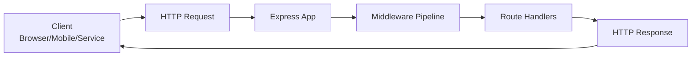
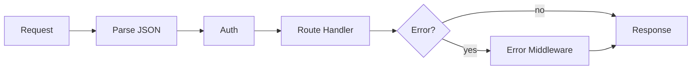

# Lesson 1: Introduction to Express.js (Long-form Enhanced)

> This lesson is intentionally long-form so it can serve as a “reference chapter” (similar depth style to the JWT enhanced example). Some sections will feel advanced on day one—use them as a guide when you get stuck later.

## Table of Contents

- What Express is and where it sits
- The request/response contract
- A tiny server (and a slightly more real mini API)
- HTTP essentials for backend work (methods, headers, content types)
- Project structure conventions (routes, middleware, services)
- Production-minded basics (env config, health/readiness, graceful shutdown)
- Security and observability baselines (high level)
- Testing and troubleshooting (Windows-friendly)

## What is Express (and what problem does it solve)?

Express is a minimal Node.js web framework that turns “raw HTTP requests” into a **structured request/response programming model**.

At a practical level, Express gives you:
- **Routing**: map HTTP method + path → code
- **Middleware pipeline**: plug in cross-cutting behavior (JSON parsing, auth, logging, CORS)
- **A clear API boundary**: the place where untrusted input becomes validated data and safe responses

Express is intentionally **unopinionated**. That makes it easy to learn, but it also means your project’s quality depends on the patterns you adopt.

## Learning Objectives

By the end of this lesson, you will be able to:
- Explain what Express is and where it sits in a backend architecture
- Build a minimal Express API server with one route
- Describe the request/response lifecycle (and where middleware fits)
- Understand “unopinionated framework” trade-offs and how to mitigate them with conventions
- Avoid common beginner failures (port conflicts, missing JSON parsing, “why is req.body undefined?”, dev vs prod confusion)

## Prerequisites

Before you start:

1. **Node.js installed** (LTS recommended)
2. **Package manager**: `pnpm` (or npm/yarn if your project uses those)
3. **Basic HTTP concepts**:
   - what a request is (method, path, headers, body)
   - what a response is (status code, headers, body)

If you’re using TypeScript in your project:

```bash
pnpm add express
pnpm add -D @types/express typescript ts-node-dev
```

## Visual: Where Express sits



## The “contract”: request in, response out

Express handlers always revolve around two objects:
- `req`: **request** data (method, path, headers, params, query, body)
- `res`: **response** builder (status code, headers, JSON, send)

The “contract” of your API is:
- **Input**: \(method, path, headers, body\)
- **Output**: \(status code, JSON body\)

Your goal is to make this contract:
- predictable (consistent shapes + codes)
- safe (validate inputs, avoid leaking internals)
- observable (logging, error tracking)

## Your first Express server

Minimal server:

```typescript
// src/server.ts
import express from "express";

const app = express();
const PORT = Number(process.env.PORT ?? 3001);

app.get("/", (req, res) => {
  res.json({ message: "Hello, Express!" });
});

app.listen(PORT, () => {
  console.log(`Server running on http://localhost:${PORT}`);
});
```

### What’s happening here (step-by-step)

- `express()` creates an application instance (your “HTTP app”)
- `app.get("/", ...)` registers a handler for **GET** requests to `/`
- `app.listen(PORT)` opens a TCP port and begins accepting requests
- `res.json(...)` serializes your object to JSON and sets the correct `Content-Type`

## Try it: manual testing with curl

```bash
curl http://localhost:3001/
```

Expected response:

```json
{ "message": "Hello, Express!" }
```

## Middleware (high-level preview)

Middleware is what makes Express scale from “one route” to “real application”.



You’ll deep-dive middleware in Lesson 3, but for now remember:
- middleware runs **in order**
- middleware must either **send a response** or call `next()`

## Build a slightly more “real” mini API (still in one file)

JWT auth needs more code because it includes cryptography, storage decisions, token lifecycle, and security trade-offs. Express itself is simpler — but you can still get “enhanced template” depth by practicing the **full request lifecycle**: parse → validate → handle → respond → troubleshoot.

This mini API adds:
- JSON body parsing
- a health check
- a create endpoint with minimal validation
- realistic status codes

### Step 1: Add JSON parsing middleware

If you don’t add this, `req.body` will often be `undefined`.

```typescript
app.use(express.json());
```

### Step 2: Add a health check

```typescript
app.get("/health", (req, res) => {
  res.status(200).json({
    ok: true,
    uptimeSeconds: Math.floor(process.uptime()),
  });
});
```

### Step 3: Add a simple “create” endpoint

This is intentionally minimal; later lessons will show robust runtime validation.

```typescript
app.post("/echo", (req, res) => {
  const { message } = req.body ?? {};

  if (typeof message !== "string" || message.trim().length === 0) {
    return res.status(400).json({
      error: "Validation Error",
      message: "`message` must be a non-empty string",
    });
  }

  return res.status(201).json({
    message: "Created",
    data: { message: message.trim() },
  });
});
```

### Manual testing (copy/paste)

```bash
# Health check
curl http://localhost:3001/health

# Create (success)
curl -X POST http://localhost:3001/echo -H "Content-Type: application/json" -d "{\"message\":\"Hello\"}"

# Create (validation error)
curl -X POST http://localhost:3001/echo -H "Content-Type: application/json" -d "{\"message\":\"\"}"
```

## Production-minded basics (early, but important)

### 1) Environment variables (ports, secrets, origins)

Even in simple apps, prefer:
- `PORT` for the listen port
- `NODE_ENV` to toggle dev/prod behavior
- `CORS_ORIGIN` when you later add CORS

### 2) Don’t leak internals in responses

In development you’ll log details; in production you return safe messages.

### 3) Prefer consistent response shapes

Even before you build “official” response helpers, be consistent:
- success responses should look similar across endpoints
- error responses should look similar across endpoints

## Real-world conventions (so Express stays maintainable)

Express won’t force structure, so you must.

Recommended early conventions:
- **Keep `server.ts` small**: wire middleware + routers, not business logic
- **Feature routers**: `routes/users.ts`, `routes/auth.ts`
- **Validation at the boundary**: validate `req.body`/`req.params`/`req.query` before using them
- **Consistent error shape**: centralize error handling (later lessons)

## Common pitfalls (and fixes)

### Pitfall 1: Port already in use (`EADDRINUSE`)

**Cause:** something else is already listening on that port.

**Fixes:**
- stop the other process, or
- change the port (prefer `PORT` env var)

### Pitfall 2: `req.body` is `undefined`

**Cause:** missing JSON parsing middleware.

**Fix:**

```typescript
app.use(express.json());
```

### Pitfall 3: “Works locally but breaks in production”

**Cause:** environment differences (CORS, HTTPS, secrets, proxy headers).

**Fix:** use environment variables, sane defaults, and explicit configuration per environment.

## Troubleshooting checklist

### Issue: “Cannot GET /something”

- confirm the route exists and the path matches
- confirm routers are mounted with the correct base path (`app.use("/api", router)`)
- confirm the server actually restarted after changes

### Issue: Browser can’t reach `localhost:3001`

- confirm the server is running and `listen` succeeded
- check the port number
- check terminal logs for crash output

---

## Advanced Foundations (Reference)

This section is intentionally “ahead of where you are” so you have a map of what matters in real APIs.

### HTTP essentials you’ll use constantly

#### Requests have four main parts

- **Method**: what you want to do (`GET`, `POST`, `PATCH`, etc.)
- **Path**: what you’re targeting (`/users/123`)
- **Headers**: metadata (`Content-Type`, `Authorization`, `Accept`)
- **Body**: data (usually JSON for APIs)

#### Responses also have four main parts

- **Status code**: outcome (`200`, `201`, `400`, `404`, `500`)
- **Headers**: metadata (`Content-Type`, caching headers, etc.)
- **Body**: typically JSON
- **Timing**: how long the server took (important for performance and debugging)

### Content types: why `Content-Type` matters

Express can’t safely guess how to parse your body.

Common content types:
- `application/json` (most APIs)
- `multipart/form-data` (file uploads)
- `application/x-www-form-urlencoded` (HTML forms)

If your client doesn’t send `Content-Type: application/json`, `express.json()` may not parse the body and `req.body` may be empty/undefined.

### Basic project structure (so Express stays maintainable)

Express won’t enforce architecture, so teams usually adopt conventions like:

```text
src/
  server.ts              # app composition + listening
  routes/                # routers: users.ts, auth.ts
  middleware/            # auth, error handling, request-id, etc.
  services/              # business logic (pure-ish functions)
  lib/                   # clients (db, logger), shared instances
  utils/                 # small helpers
```

Rule of thumb:
- **Routes**: parse/validate at the boundary, call services, return responses
- **Services**: business logic (can be tested without HTTP)
- **Middleware**: cross-cutting concerns (auth, logging, validation, errors)

### Environment config (minimum viable)

In most backends you’ll at least use:
- `PORT` (listen port)
- `NODE_ENV` (`development` vs `production`)
- `CORS_ORIGIN` (when you add browser clients)
- secrets (JWT secret, DB url, etc.) via environment variables

### Health vs readiness (production)

Two common endpoints:
- **Liveness** (`/health`): “process is alive”
- **Readiness** (`/ready`): “app is ready to serve traffic” (DB connected, migrations done, etc.)

Example (simple):

```typescript
app.get("/ready", (req, res) => {
  // In real apps: check DB connectivity, required env vars, etc.
  res.status(200).json({ ready: true });
});
```

### Graceful shutdown (advanced, but important)

In production, your process should shut down cleanly on SIGTERM/SIGINT:

```typescript
const server = app.listen(PORT, () => {
  console.log(`Server running on http://localhost:${PORT}`);
});

function shutdown(signal: string) {
  console.log(`Received ${signal}, shutting down...`);
  server.close(() => {
    console.log("HTTP server closed");
    process.exit(0);
  });
}

process.on("SIGINT", () => shutdown("SIGINT"));
process.on("SIGTERM", () => shutdown("SIGTERM"));
```

### Security baseline (high level)

Even early, keep these in mind:
- don’t leak stack traces or internal errors to clients
- don’t log secrets (passwords, full auth headers)
- prefer HTTPS in production
- consider `helmet` for security headers (introduced in the middleware lesson)

### Observability baseline (high level)

Eventually you’ll want:
- request logging
- request IDs (`x-request-id`)
- structured logs (JSON) in production
- centralized error handling

## Windows-friendly testing note

In PowerShell, `curl` is often an alias for `Invoke-WebRequest`. Use `curl.exe` if your commands behave strangely.

```bash
curl.exe http://localhost:3001/health
```

## Advanced troubleshooting quick hits

### Issue: `req.body` is undefined

- ensure `app.use(express.json())` runs before routes
- ensure request includes `Content-Type: application/json`

### Issue: “Port already in use” keeps happening

- stop the other server instance
- or change `PORT`
- confirm you don’t have two dev servers running in different terminals

## Next Steps

1. ✅ **Practice**: Add `GET /health` returning `{ ok: true }`
2. ✅ **Experiment**: Return different status codes (`res.status(204).send()`)
3. 📖 **Next Lesson**: Learn about [Routing](./lesson-02-routing.md)
4. 💻 **Complete Exercises**: Work through [Exercises 01](./exercises-01.md)

## Additional Resources

- [Express Docs](https://expressjs.com/)
- [MDN: HTTP Status Codes](https://developer.mozilla.org/en-US/docs/Web/HTTP/Status)
- [Node.js HTTP Primer](https://nodejs.org/api/http.html)

---

**Key Takeaways:**
- Express is a thin layer over HTTP: method + path + handler.
- Middleware is the core model; order matters.
- Treat requests as untrusted input; validate at the boundary.
- Start with conventions early so your app remains maintainable as it grows.
