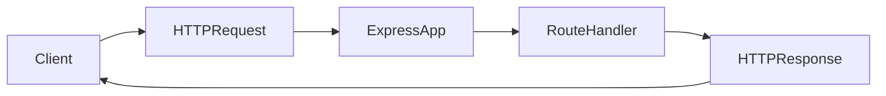

# Lesson 1: Introduction to Express.js

## Learning Objectives

By the end of this lesson, you will be able to:
- Explain what Express is and what role it plays in a backend
- Create a minimal Express server and define your first route
- Understand the request/response lifecycle at a high level
- Recognize what middleware is (and why almost everything in Express is middleware)
- Avoid common beginner pitfalls (port conflicts, missing JSON parsing, confusing dev vs prod)

## Why Express Matters

Express is one of the most common Node.js web frameworks for building APIs.

It gives you:
- routing (URLs + HTTP methods)
- middleware pipeline (plug in parsing, auth, logging, etc.)
- request/response primitives that map closely to HTTP

Express is “unopinionated”, which is both a strength (flexibility) and a responsibility (you must choose patterns).



## What is Express.js?

Express is a minimal, flexible Node.js web framework for building APIs and web applications.

In this course, we’ll use it primarily for:
- REST APIs
- authentication and authorization
- integration with a database (via Prisma later)

## Why Express?

- **Minimal**: you only add what you need
- **Flexible**: supports many architecture styles
- **Ecosystem**: lots of middleware available (CORS, security headers, logging)
- **TypeScript-friendly**: strong typing via `@types/express`

## Your First Express Server

```typescript
// src/server.ts
import express from "express";

const app = express();
const PORT = 3001;

app.get("/", (req, res) => {
  res.json({ message: "Hello, Express!" });
});

app.listen(PORT, () => {
  console.log(`Server running on http://localhost:${PORT}`);
});
```

### What’s happening here

- `express()` creates an application instance (your server)
- `app.get("/", ...)` registers a route handler for GET `/`
- `app.listen(...)` starts listening for incoming requests

## Running the Server

```bash
pnpm dev
```

Then open `http://localhost:3001` (or curl it).

## Key Concepts

- **Routes**: match an HTTP method + path (e.g., GET `/users`)
- **Middleware**: functions that run before/around route handlers
- **Request/Response**: Express wraps Node’s request/response with helpful utilities
- **TypeScript**: enables safer request typing and fewer runtime surprises

## Real-World Scenario: A Typical API Request

When a browser requests `/api/users`:
1. Express receives the request
2. Middleware runs (logging, JSON parsing, auth)
3. A route handler runs (fetch users, validate data)
4. Express sends a response (JSON + status code)

## Best Practices

### 1) Keep your server entrypoint small

Your `server.ts` should mostly assemble middleware and routes, not contain all logic.

### 2) Use clear status codes

- 200 OK for successful reads
- 201 Created for successful creates
- 400 for bad input
- 401/403 for auth
- 500 for unexpected server errors

### 3) Log and handle errors consistently

You’ll add structured error middleware later in the course.

## Common Pitfalls and Solutions

### Pitfall 1: Port already in use

**Problem:** `EADDRINUSE` when starting the server.

**Solution:** Stop the other process or change the port.

### Pitfall 2: `req.body` is undefined

**Problem:** You forgot JSON body parsing middleware.

**Solution:** Add `app.use(express.json())` (covered in the middleware lesson).

### Pitfall 3: Mixing dev and prod behaviors

**Problem:** Debug logs or unsafe CORS settings shipped to production.

**Solution:** Use environment variables and sane defaults for each environment.

## Troubleshooting

### Issue: Server starts but routes return 404

**Symptoms:**
- `Cannot GET /something`

**Solutions:**
1. Confirm the route exists and the path matches.
2. Confirm you registered the router with `app.use(...)`.

### Issue: You can’t reach `localhost:3001`

**Symptoms:**
- browser can’t connect

**Solutions:**
1. Confirm the server is running and listening on the expected port.
2. Check terminal logs for startup errors.

## Next Steps

Now that you can start an Express server:

1. ✅ **Practice**: Add a second route (`GET /health`)
2. ✅ **Experiment**: Return different status codes
3. 📖 **Next Lesson**: Learn about [Routing](./lesson-02-routing.md)
4. 💻 **Complete Exercises**: Work through [Exercises 01](./exercises-01.md)

## Additional Resources

- [Express Docs](https://expressjs.com/)
- [MDN: HTTP Status Codes](https://developer.mozilla.org/en-US/docs/Web/HTTP/Status)

---

**Key Takeaways:**
- Express is a minimal Node.js framework for building APIs.
- Routes map HTTP methods + paths to handlers.
- Middleware forms a pipeline that processes requests before sending responses.
- Keep your entrypoint small and build consistent patterns early.
