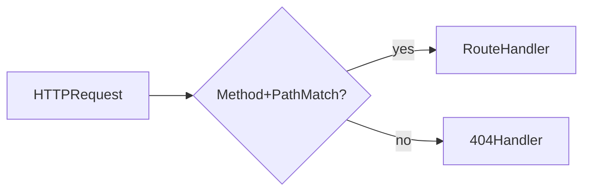
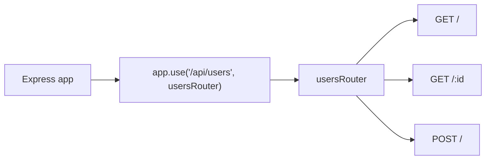

# Lesson 2: Routing (Long-form Enhanced)

> This lesson is intentionally **long-form** (more like a reference chapter) so it matches the depth/style of the JWT enhanced example: deeper mental models, more complete examples, and a stronger testing + troubleshooting story.

## Table of Contents

- What routing is (really)
- Basic routes + status codes
- Route parameters (`req.params`) and safe parsing
- Query parameters (`req.query`) for filtering/pagination
- Route ordering pitfalls (`/users/me` vs `/users/:id`)
- Router modules (`express.Router`) and mounting (`app.use("/base", router)`)
- Complete mini “Users API” example (in-memory)
- Manual testing (including Windows `curl.exe`)
- Troubleshooting checklist

## Learning Objectives

By the end of this lesson, you will be able to:
- Define basic routes with HTTP methods (`GET`, `POST`, `PUT`, `DELETE`)
- Read route parameters (`req.params`) and query parameters (`req.query`)
- Structure routes using `express.Router()` modules
- Chain multiple handlers (middleware + final handler) for a route
- Recognize common pitfalls (wrong base paths, missing router mounting, string vs number params)

## Why Routing Matters

Routing is how an API exposes “resources” over HTTP:
- `/users` (collection)
- `/users/:id` (single resource)
- `/posts`, `/posts/:id`, etc.

Express routing maps method + path to code that produces a response.



## Basic Routes

```typescript
app.get("/users", (req, res) => {
  res.json({ users: [] });
});

app.post("/users", (req, res) => {
  res.status(201).json({ message: "User created" });
});
```

### Use the right status codes

- GET typically returns 200
- POST create typically returns 201

## Route Parameters (`req.params`)

Use `:param` segments for dynamic IDs.

```typescript
app.get("/users/:id", (req, res) => {
  const { id } = req.params; // string
  res.json({ userId: id });
});
```

### Converting IDs safely

Most DB IDs are numbers or UUID strings. If numeric:

```typescript
const id = Number(req.params.id);
if (!Number.isFinite(id)) return res.status(400).json({ error: "Invalid id" });
```

## Query Parameters (`req.query`)

Query params are used for filters, search, pagination:

```typescript
app.get("/search", (req, res) => {
  const { q } = req.query; // string | string[] | undefined
  res.json({ query: q });
});
```

### Example: pagination

```typescript
app.get("/users", (req, res) => {
  const page = Number(req.query.page ?? 1);
  const limit = Number(req.query.limit ?? 20);
  res.json({ page, limit });
});
```

## Multiple Handlers (Middleware + Handler)

Routes can chain multiple handlers. This is how you apply auth, validation, etc.

```typescript
app.get(
  "/users",
  (req, res, next) => {
    // Middleware (runs first)
    next();
  },
  (req, res) => {
    // Final handler
    res.json({ users: [] });
  }
);
```

## Router Modules (`express.Router`)

As projects grow, put related routes into a router module and mount it.

```typescript
// src/routes/users.ts
import { Router } from "express";

const router = Router();

router.get("/", (req, res) => {
  res.json({ users: [] });
});

export default router;
```

```typescript
// src/server.ts
import usersRouter from "./routes/users";
app.use("/users", usersRouter);
```

### How mounting works

If `usersRouter` defines `router.get("/")`, and you mount at `/users`,
the final path is `GET /users`.

## Real-World Scenario: Building a REST-ish Users API

Common endpoints:
- `GET /users` list users
- `POST /users` create user
- `GET /users/:id` fetch one user
- `PUT /users/:id` update user
- `DELETE /users/:id` delete user

This course will build toward these patterns consistently.

## Best Practices

### 1) Keep routers feature-scoped

Create `routes/users.ts`, `routes/posts.ts`, etc.

### 2) Validate inputs at the boundary

Convert params/query values early, validate shape, and respond with 400 on bad input.

### 3) Keep handlers small

Move business logic into services/helpers so route files stay readable.

## Common Pitfalls and Solutions

### Pitfall 1: Router mounted at wrong base path

**Problem:** `/users` returns 404.

**Solution:** Confirm `app.use("/users", usersRouter)` matches your intended routes.

### Pitfall 2: Treating `req.params.id` as a number

**Problem:** You pass a string to a numeric DB query and get unexpected behavior.

**Solution:** Convert and validate early.

### Pitfall 3: Returning inconsistent response shapes

**Problem:** Sometimes you return `{ user: ... }`, sometimes just `user`.

**Solution:** Decide on a response format and use it consistently (covered later).

## Troubleshooting

### Issue: "Cannot GET /users"

**Symptoms:**
- Express responds with 404 for a route you think exists

**Solutions:**
1. Confirm the route is registered before `app.listen`.
2. Confirm router mounting path and route path align.

### Issue: Query params are `undefined`

**Symptoms:**
- `req.query.q` is missing

**Solutions:**
1. Confirm your request URL includes `?q=...`.
2. Handle optional query params with defaults.

## Next Steps

Now that you can define routes:

1. ✅ **Practice**: Add `/users/:id` and validate the id
2. ✅ **Experiment**: Add `/search?q=...` and handle missing query values
3. 📖 **Next Lesson**: Learn about [Middleware](./lesson-03-middleware.md)
4. 💻 **Complete Exercises**: Work through [Exercises 01](./exercises-01.md)

## Additional Resources

- [Express Docs: Routing](https://expressjs.com/en/guide/routing.html)
- [MDN: URL query string](https://developer.mozilla.org/en-US/docs/Web/API/URLSearchParams)

---

**Key Takeaways:**
- Routing maps HTTP methods + paths to handlers.
- `req.params` comes from `:param` segments; it’s always strings.
- `req.query` is for search/filter/pagination and often needs parsing.
- Use `express.Router()` to keep route files organized and scalable.

---

## What routing is (really)

Routing is the mapping from an HTTP request to code:
- **Method**: `GET`, `POST`, `PUT`, `PATCH`, `DELETE`
- **Path**: `/users`, `/users/123`
- **Pattern**: `/users/:id`

Express will evaluate routes in the **order you register them**. The first matching route wins.

```mermaid
flowchart LR
  req[Incoming request] --> scan[Try routes in registration order]
  scan --> match{Method + path matches?}
  match -->|No| scan
  match -->|Yes| chain[Run handler chain]
  chain --> done[Response or next()]
```

## Status codes: the minimum you should be consistent about

Routing isn’t only “which code runs” — it also defines the client contract.

- **200 OK**: successful reads
- **201 Created**: successful creates
- **204 No Content**: successful deletes (no response body)
- **400 Bad Request**: invalid client input (bad id, missing fields)
- **404 Not Found**: resource doesn’t exist
- **401 Unauthorized**: missing/invalid authentication
- **403 Forbidden**: authenticated but not allowed

## Route parameters (`req.params`) — safe parsing patterns

`req.params` values are always **strings**.

### A reusable parser helper

```typescript
function parsePositiveInt(value: string): number | null {
  const n = Number(value);
  if (!Number.isInteger(n) || n <= 0) return null;
  return n;
}
```

### Apply it at the boundary

```typescript
app.get("/users/:id", (req, res) => {
  const id = parsePositiveInt(req.params.id);
  if (id === null) return res.status(400).json({ error: "Invalid id" });

  return res.status(200).json({ userId: id });
});
```

## Query parameters (`req.query`) — defaults + clamping

Query params often arrive as `string | string[] | undefined`.

### Pagination example

```typescript
function parseIntOr(value: unknown, fallback: number): number {
  if (typeof value !== "string") return fallback;
  const n = Number(value);
  if (!Number.isInteger(n)) return fallback;
  return n;
}

app.get("/users", (req, res) => {
  const page = Math.max(1, parseIntOr(req.query.page, 1));
  const limit = Math.min(100, Math.max(1, parseIntOr(req.query.limit, 20)));

  return res.json({ page, limit });
});
```

Clamping `limit` helps prevent expensive queries like `?limit=999999`.

## Pitfall: route order can “steal” requests

This bug is extremely common:

```typescript
app.get("/users/:id", (req, res) => {
  res.json({ route: "id", id: req.params.id });
});

app.get("/users/me", (req, res) => {
  res.json({ route: "me" });
});
```

`GET /users/me` will hit **`/users/:id` first** and treat `"me"` as an id.

### Fix: register specific routes before parameter routes

```typescript
app.get("/users/me", (req, res) => {
  res.json({ route: "me" });
});

app.get("/users/:id", (req, res) => {
  res.json({ route: "id", id: req.params.id });
});
```

This exact pattern shows up later with `/auth/me` and other “special” endpoints.

## Routers (`express.Router`) and mounting (the #1 reason for accidental 404s)

Routers are “mini apps” that you mount under a base path.



Mounting rule:
- router path is **relative**
- mount path is **prefix**
- final path = mount + router route

## Complete mini “Users API” example (in-memory)

This is intentionally “no database” so you can focus on routing mechanics.

### `src/routes/users.ts`

```typescript
import { Router } from "express";

const router = Router();

type User = { id: number; email: string; name: string };
const users: User[] = [
  { id: 1, email: "alice@example.com", name: "Alice" },
  { id: 2, email: "bob@example.com", name: "Bob" },
];

function parsePositiveInt(value: string): number | null {
  const n = Number(value);
  if (!Number.isInteger(n) || n <= 0) return null;
  return n;
}

// GET /api/users
router.get("/", (req, res) => {
  res.status(200).json({ users });
});

// GET /api/users/:id
router.get("/:id", (req, res) => {
  const id = parsePositiveInt(req.params.id);
  if (id === null) return res.status(400).json({ error: "Invalid id" });

  const user = users.find((u) => u.id === id);
  if (!user) return res.status(404).json({ error: "User not found" });

  return res.status(200).json({ user });
});

// POST /api/users
router.post("/", (req, res) => {
  const { email, name } = req.body ?? {};

  if (typeof email !== "string" || !email.includes("@")) {
    return res.status(400).json({ error: "Invalid email" });
  }
  if (typeof name !== "string" || name.trim().length === 0) {
    return res.status(400).json({ error: "Invalid name" });
  }

  const nextId = (users.at(-1)?.id ?? 0) + 1;
  const user: User = { id: nextId, email: email.trim(), name: name.trim() };
  users.push(user);

  return res.status(201).json({ user });
});

export default router;
```

### `src/server.ts` (mounting the router)

```typescript
import express from "express";
import usersRouter from "./routes/users";

const app = express();
app.use(express.json());

app.use("/api/users", usersRouter);

app.listen(3001, () => console.log("Listening on http://localhost:3001"));
```

## Manual testing (including Windows PowerShell)

### Windows PowerShell note

In PowerShell, `curl` is commonly an alias for `Invoke-WebRequest`.
Use **`curl.exe`** to run real curl.

### List users

```bash
curl.exe http://localhost:3001/api/users
```

### Get user

```bash
curl.exe http://localhost:3001/api/users/1
curl.exe http://localhost:3001/api/users/999
curl.exe http://localhost:3001/api/users/not-a-number
```

### Create user

```bash
curl.exe -X POST http://localhost:3001/api/users -H "Content-Type: application/json" -d "{\"email\":\"carol@example.com\",\"name\":\"Carol\"}"
```

## Troubleshooting checklist (routing-specific)

### Issue: `Cannot GET /users`

**Most likely cause:** you mounted your router under `/api`.

**Fix:** call `/api/users`, or mount at `/users`.

### Issue: `GET /api/users` returns 404 but you “have the route”

**Checklist:**
1. Confirm you mounted the router: `app.use("/api/users", usersRouter)`
2. Confirm the router defines `router.get("/")` (not `router.get("/api/users")`)
3. Confirm the server restarted

### Issue: `req.body` is undefined on POST

**Fixes:**
1. Ensure `app.use(express.json())` runs before routes
2. Ensure client sets `Content-Type: application/json`

---

## Advanced Routing Patterns (Reference)

This section goes beyond basic CRUD routes and covers patterns you’ll see in real production APIs.

### 1) API versioning and mount strategy

Common approaches:

- **Path versioning** (most common for public APIs): `/api/v1/users`
- **Header versioning** (less common): `Accept: application/vnd.myapp.v1+json`

Simple path versioning with routers:

```typescript
import express from "express";
import usersRouter from "./routes/users";

const app = express();
app.use(express.json());

app.use("/api/v1/users", usersRouter);

// Later:
// app.use("/api/v2/users", usersV2Router);
```

**Trade-off notes:**
- Path versioning is easy to understand and test.
- Versioning increases maintenance cost—use it when you need backward compatibility.

### 2) Nested routers and `mergeParams`

When you nest routers, you often want parent params (like `:userId`) to be visible inside the child router.

Example goal: `/api/users/:userId/posts/:postId`

```typescript
// src/routes/users.ts
import { Router } from "express";
import postsRouter from "./users.posts";

const router = Router();

router.use("/:userId/posts", postsRouter);

export default router;
```

```typescript
// src/routes/users.posts.ts
import { Router } from "express";

// IMPORTANT: mergeParams lets this router read :userId from the parent route
const router = Router({ mergeParams: true });

router.get("/", (req, res) => {
  res.json({ userId: req.params.userId, posts: [] });
});

router.get("/:postId", (req, res) => {
  res.json({ userId: req.params.userId, postId: req.params.postId });
});

export default router;
```

**Common pitfall:** without `mergeParams: true`, `req.params.userId` will be `undefined` in the nested router.

### 3) Content negotiation (Accept) and response types

Most course APIs return JSON always, but “real APIs” sometimes vary output formats.

At minimum, you should understand:
- clients send `Accept` to indicate desired response format
- servers send `Content-Type` to state what they returned

Simple JSON-only stance (recommended for most internal APIs):

```typescript
app.use((req, res, next) => {
  // If client explicitly says it cannot accept JSON, reject.
  // Many APIs skip this for simplicity; include it if you need strictness.
  const accept = req.headers.accept;
  if (accept && !accept.includes("application/json") && !accept.includes("*/*")) {
    return res.status(406).json({ error: "Only application/json is supported" });
  }
  return next();
});
```

### 4) Input “shape” errors: 404 vs 405 vs 415 vs 406

Routing-related status codes that show up in mature APIs:
- **404 Not Found**: no route matches path+method
- **405 Method Not Allowed**: path exists but method doesn’t (Express does not emit this automatically by default)
- **415 Unsupported Media Type**: server can’t parse/handle the request body type (e.g., missing/incorrect `Content-Type`)
- **406 Not Acceptable**: server can’t produce a response matching `Accept`

Practical takeaway: keep it simple early (404/400), but know these exist for stricter API contracts.

### 5) Route patterns and “safe matching”

Sometimes you want to ensure `:id` is numeric at the routing layer.

Express supports regex-style params:

```typescript
// Matches only digits; /users/me will NOT match this route.
app.get("/users/:id(\\d+)", (req, res) => {
  res.json({ id: Number(req.params.id) });
});
```

**Why this is useful:**
- prevents the “/users/me hits /users/:id” pitfall even if you register in the wrong order
- reduces the amount of invalid traffic hitting your handler

### 6) Authorization placement as a routing concern

Security is not just “auth code” — it’s also **where** you mount and apply it.

Common patterns:

```typescript
// All /api routes require authentication
app.use("/api", authenticate);
app.use("/api/users", usersRouter);
```

or:

```typescript
// Only certain routers are protected
app.use("/api/public", publicRouter);
app.use("/api/users", authenticate, usersRouter);
```

**Rule of thumb:**
- protect at the highest reasonable level (router mount) to avoid forgetting auth on one endpoint
- still keep exceptions explicit (e.g., `/api/auth/login` must remain public)

### 7) Observability: request IDs and route-level logging

Routing is one of the best places to attach request-scoped context.

Minimal request-id middleware:

```typescript
import crypto from "crypto";

app.use((req, res, next) => {
  const id = req.headers["x-request-id"]?.toString() ?? crypto.randomUUID();
  res.setHeader("x-request-id", id);
  (req as any).requestId = id;
  next();
});
```

Then your routes can log with that id (and later, with user id once authenticated).

### 8) Contract-first mindset: OpenAPI (advanced but worth knowing)

In production teams, routes often come from a contract:
- OpenAPI/Swagger spec defines endpoints, params, request bodies, and responses
- code is implemented to match the spec

You don’t need OpenAPI yet to learn routing, but the key idea is:

> **Routing is part of a contract**. The more consistent and explicit you are, the easier it is for clients to integrate (and for you to evolve safely).

## Advanced troubleshooting

### Issue: Nested router can’t see `:userId`

**Cause:** missing `mergeParams: true`.

**Fix:** `Router({ mergeParams: true })` in the child router.

### Issue: `/users/me` keeps hitting the id route

**Fix options:**
1. Register `/users/me` before `/users/:id`
2. Use a regex param route: `/users/:id(\\d+)`

### Issue: PowerShell curl behaves weirdly

**Cause:** PowerShell aliases `curl` to `Invoke-WebRequest`.

**Fix:** use `curl.exe` for real curl, or use PowerShell’s `Invoke-RestMethod`.
