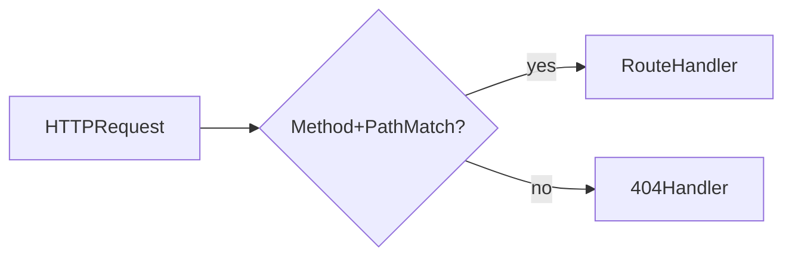

# Lesson 2: Routing

## Learning Objectives

By the end of this lesson, you will be able to:
- Define basic routes with HTTP methods (`GET`, `POST`, `PUT`, `DELETE`)
- Read route parameters (`req.params`) and query parameters (`req.query`)
- Structure routes using `express.Router()` modules
- Chain multiple handlers (middleware + final handler) for a route
- Recognize common pitfalls (wrong base paths, missing router mounting, string vs number params)

## Why Routing Matters

Routing is how an API exposes “resources” over HTTP:
- `/users` (collection)
- `/users/:id` (single resource)
- `/posts`, `/posts/:id`, etc.

Express routing maps method + path to code that produces a response.



## Basic Routes

```typescript
app.get("/users", (req, res) => {
  res.json({ users: [] });
});

app.post("/users", (req, res) => {
  res.status(201).json({ message: "User created" });
});
```

### Use the right status codes

- GET typically returns 200
- POST create typically returns 201

## Route Parameters (`req.params`)

Use `:param` segments for dynamic IDs.

```typescript
app.get("/users/:id", (req, res) => {
  const { id } = req.params; // string
  res.json({ userId: id });
});
```

### Converting IDs safely

Most DB IDs are numbers or UUID strings. If numeric:

```typescript
const id = Number(req.params.id);
if (!Number.isFinite(id)) return res.status(400).json({ error: "Invalid id" });
```

## Query Parameters (`req.query`)

Query params are used for filters, search, pagination:

```typescript
app.get("/search", (req, res) => {
  const { q } = req.query; // string | string[] | undefined
  res.json({ query: q });
});
```

### Example: pagination

```typescript
app.get("/users", (req, res) => {
  const page = Number(req.query.page ?? 1);
  const limit = Number(req.query.limit ?? 20);
  res.json({ page, limit });
});
```

## Multiple Handlers (Middleware + Handler)

Routes can chain multiple handlers. This is how you apply auth, validation, etc.

```typescript
app.get(
  "/users",
  (req, res, next) => {
    // Middleware (runs first)
    next();
  },
  (req, res) => {
    // Final handler
    res.json({ users: [] });
  }
);
```

## Router Modules (`express.Router`)

As projects grow, put related routes into a router module and mount it.

```typescript
// src/routes/users.ts
import { Router } from "express";

const router = Router();

router.get("/", (req, res) => {
  res.json({ users: [] });
});

export default router;
```

```typescript
// src/server.ts
import usersRouter from "./routes/users";
app.use("/users", usersRouter);
```

### How mounting works

If `usersRouter` defines `router.get("/")`, and you mount at `/users`,
the final path is `GET /users`.

## Real-World Scenario: Building a REST-ish Users API

Common endpoints:
- `GET /users` list users
- `POST /users` create user
- `GET /users/:id` fetch one user
- `PUT /users/:id` update user
- `DELETE /users/:id` delete user

This course will build toward these patterns consistently.

## Best Practices

### 1) Keep routers feature-scoped

Create `routes/users.ts`, `routes/posts.ts`, etc.

### 2) Validate inputs at the boundary

Convert params/query values early, validate shape, and respond with 400 on bad input.

### 3) Keep handlers small

Move business logic into services/helpers so route files stay readable.

## Common Pitfalls and Solutions

### Pitfall 1: Router mounted at wrong base path

**Problem:** `/users` returns 404.

**Solution:** Confirm `app.use("/users", usersRouter)` matches your intended routes.

### Pitfall 2: Treating `req.params.id` as a number

**Problem:** You pass a string to a numeric DB query and get unexpected behavior.

**Solution:** Convert and validate early.

### Pitfall 3: Returning inconsistent response shapes

**Problem:** Sometimes you return `{ user: ... }`, sometimes just `user`.

**Solution:** Decide on a response format and use it consistently (covered later).

## Troubleshooting

### Issue: "Cannot GET /users"

**Symptoms:**
- Express responds with 404 for a route you think exists

**Solutions:**
1. Confirm the route is registered before `app.listen`.
2. Confirm router mounting path and route path align.

### Issue: Query params are `undefined`

**Symptoms:**
- `req.query.q` is missing

**Solutions:**
1. Confirm your request URL includes `?q=...`.
2. Handle optional query params with defaults.

## Next Steps

Now that you can define routes:

1. ✅ **Practice**: Add `/users/:id` and validate the id
2. ✅ **Experiment**: Add `/search?q=...` and handle missing query values
3. 📖 **Next Lesson**: Learn about [Middleware](./lesson-03-middleware.md)
4. 💻 **Complete Exercises**: Work through [Exercises 01](./exercises-01.md)

## Additional Resources

- [Express Docs: Routing](https://expressjs.com/en/guide/routing.html)
- [MDN: URL query string](https://developer.mozilla.org/en-US/docs/Web/API/URLSearchParams)

---

**Key Takeaways:**
- Routing maps HTTP methods + paths to handlers.
- `req.params` comes from `:param` segments; it’s always strings.
- `req.query` is for search/filter/pagination and often needs parsing.
- Use `express.Router()` to keep route files organized and scalable.
