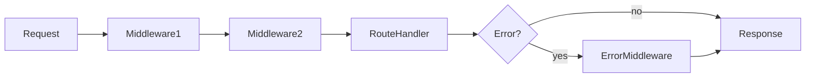
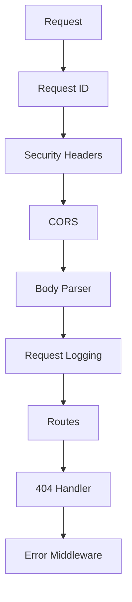

# Lesson 3: Middleware (Long-form Enhanced)

> Middleware is the “engine room” of Express. This long-form lesson expands the basic concepts into production patterns: ordering, async error propagation, security middleware, request context, and troubleshooting.

## Table of Contents

- Middleware pipeline mental model
- The `next()` contract (and how requests “hang”)
- Built-in middleware (JSON, URL-encoded) + body size limits
- Third-party middleware (CORS, Helmet) and common misconfigurations
- Custom middleware patterns (logger, request id, auth stubs)
- Error middleware (4-arg signature) + async error handling patterns
- Advanced topics: proxy trust, redaction, idempotency, and layering
- Manual testing + troubleshooting checklist

## Learning Objectives

By the end of this lesson, you will be able to:
- Explain what middleware is and how the Express pipeline works
- Use built-in middleware (`express.json`, `express.urlencoded`)
- Add third-party middleware (CORS, security headers)
- Write custom middleware for logging and auth checks
- Implement error-handling middleware correctly (signature + placement)

## Why Middleware Matters

Express is fundamentally a middleware pipeline.

Middleware lets you add cross-cutting behavior:
- parse request bodies
- log requests
- enforce auth
- handle errors consistently



## What is Middleware?

A middleware function can access:
- `req` (request)
- `res` (response)
- `next` (a function that hands control to the next middleware/handler)

If middleware does **not** call `next()` or send a response, the request will “hang”.

## Basic Middleware (Logger)

```typescript
app.use((req, res, next) => {
  console.log(`${req.method} ${req.path}`);
  next(); // pass control onward
});
```

### Why this is useful

Even simple logging is valuable for debugging and production observability.

## Body Parsing Middleware

### JSON Parser

```typescript
app.use(express.json()); // Parse JSON bodies
```

If you don’t add this, `req.body` will often be `undefined` for JSON requests.

### JSON parser limits (production-safe defaults)

Unbounded JSON bodies can cause memory pressure (or worse). Set an explicit limit:

```typescript
app.use(express.json({ limit: "1mb" }));
```

If clients exceed this, Express will throw an error you should convert into a safe response via error middleware.

### URL-encoded Parser

```typescript
app.use(express.urlencoded({ extended: true })); // Parse form bodies
```

Useful for HTML form submissions (less common in API-only services).

## CORS Middleware

Browsers enforce CORS for cross-origin requests. If your frontend runs on `localhost:3000`
and backend runs on `localhost:3001`, you typically need CORS configured.

```typescript
import cors from "cors";

app.use(
  cors({
    origin: process.env.CORS_ORIGIN || "http://localhost:3000",
    credentials: true,
  })
);
```

### Important note

If you use cookie-based auth, `credentials: true` (and correct cookie settings) matter.

## Security Middleware

`helmet` sets helpful HTTP security headers.

```typescript
import helmet from "helmet";

app.use(helmet());
```

## Custom Middleware (Typed)

Custom middleware often benefits from TypeScript types:

```typescript
import type { NextFunction, Request, Response } from "express";

function logger(req: Request, res: Response, next: NextFunction) {
  console.log(`${new Date().toISOString()} - ${req.method} ${req.path}`);
  next();
}

app.use(logger);
```

## Error-Handling Middleware (Critical)

Error middleware has a special signature with **4 parameters**:

```typescript
import type { NextFunction, Request, Response } from "express";

app.use((err: Error, req: Request, res: Response, next: NextFunction) => {
  console.error(err);
  res.status(500).json({ error: "Internal server error" });
});
```

### Placement matters

Error middleware should be registered **after** routes, so it can catch errors from them.

## Advanced: async errors (why some errors “skip” your error middleware)

### The problem

In Express, a thrown error inside an async handler doesn’t always get forwarded the way beginners expect (especially in older patterns or when you forget to `return` a promise).

### A safe pattern: `asyncHandler`

Wrap async route handlers and forward failures to `next(err)`:

```typescript
import type { NextFunction, Request, Response, RequestHandler } from "express";

export function asyncHandler(
  fn: (req: Request, res: Response, next: NextFunction) => Promise<unknown>
): RequestHandler {
  return (req, res, next) => {
    Promise.resolve(fn(req, res, next)).catch(next);
  };
}
```

Usage:

```typescript
app.get(
  "/boom",
  asyncHandler(async (req, res) => {
    // Simulate a failure
    throw new Error("Boom");
  })
);
```

### Error middleware should treat `err` as `unknown`

Not everything thrown is an `Error` instance.

```typescript
import type { NextFunction, Request, Response } from "express";

app.use((err: unknown, req: Request, res: Response, next: NextFunction) => {
  console.error(err);
  return res.status(500).json({ error: "Internal server error" });
});
```

## Advanced: request context (request ids)

Request ids make logs debuggable in production, especially when many requests interleave.

```typescript
import crypto from "crypto";

app.use((req, res, next) => {
  const requestId = req.headers["x-request-id"]?.toString() ?? crypto.randomUUID();
  res.setHeader("x-request-id", requestId);
  (req as any).requestId = requestId;
  next();
});
```

### Security note

Never log secrets:
- passwords
- full `Authorization` header
- cookies (unless redacted)

## Advanced: proxy environments and real client IP

If you deploy behind a reverse proxy/load balancer, Express may see the proxy IP unless configured.

```typescript
// Example: trust first proxy hop (common in production)
app.set("trust proxy", 1);
```

This matters for:
- rate limiting (IP-based)
- logging
- secure cookies (when HTTPS terminates at the proxy)

## Layering pattern: a production-ish middleware stack (example)

Order is intentional:



Example assembly:

```typescript
import express from "express";
import cors from "cors";
import helmet from "helmet";

const app = express();

app.use(helmet());
app.use(cors({ origin: process.env.CORS_ORIGIN, credentials: true }));
app.use(express.json({ limit: "1mb" }));

// Routes here...

// 404 handler (runs only if no route matched)
app.use((req, res) => res.status(404).json({ error: "Not Found" }));

// Error middleware last
app.use((err: unknown, req, res, next) => {
  console.error(err);
  res.status(500).json({ error: "Internal server error" });
});
```

## Manual testing (Windows PowerShell friendly)

PowerShell note: use `curl.exe` for real curl.

```bash
curl.exe http://localhost:3001/health
```

To test JSON parsing and validation, hit any POST endpoint you have and verify:
- missing `Content-Type: application/json` behaves differently than correct requests
- large bodies get rejected if you set a limit

## Real-World Scenario: Auth Middleware

Many APIs use middleware for auth checks:
- read token from `Authorization` header
- validate token
- attach `req.user`
- call `next()` or return 401/403

You’ll build toward this pattern in the auth/security level.

## Best Practices

### 1) Keep middleware ordered and intentional

Order matters:
- body parsing must happen before handlers that read `req.body`
- auth should happen before protected routes
- error middleware should be last

### 2) Prefer small, focused middleware

One job per middleware makes debugging easier.

### 3) Always terminate or call `next()`

If you neither send a response nor call `next()`, requests will hang.

## Common Pitfalls and Solutions

### Pitfall 1: `req.body` is undefined

**Problem:** JSON parser middleware is missing.

**Solution:** Add `app.use(express.json())` near the top.

### Pitfall 2: Error middleware never runs

**Problem:** It was registered before routes, or you didn’t call `next(err)`.

**Solution:** Register error middleware after routes; propagate errors properly.

### Pitfall 3: CORS issues in the browser

**Problem:** The browser blocks your request.

**Solution:** Configure CORS with the correct origin and credentials settings.

## Troubleshooting

### Issue: Request “hangs” (never completes)

**Symptoms:**
- browser spins forever

**Solutions:**
1. Ensure your middleware calls `next()` or returns a response.
2. Ensure your route handler sends a response in all branches.

### Issue: Preflight `OPTIONS` requests failing

**Symptoms:**
- CORS errors in browser

**Solutions:**
1. Ensure CORS middleware is installed and configured.
2. Ensure the backend allows required headers/methods.

### Issue: `req.body` is `{}` or `undefined` (even though you “sent JSON”)

**Common causes:**
- Missing `app.use(express.json(...))`, or it’s registered after routes
- Client didn’t send `Content-Type: application/json`
- Request is actually `multipart/form-data` (uploads) or `application/x-www-form-urlencoded`

**Solutions:**
1. Ensure JSON middleware runs before routes: `app.use(express.json())`
2. Confirm client headers include `Content-Type: application/json`
3. If uploading files, use upload middleware (Multer) instead of JSON parsing

### Issue: 413 / “Payload Too Large” after adding `express.json({ limit: ... })`

**Cause:** Client is sending a body larger than your configured limit.

**Solutions:**
1. Increase the limit carefully (don’t set it to “infinite”)
2. Consider switching large payloads to file upload patterns (multipart/S3) instead of huge JSON
3. Add a clear error response in error middleware for body parse failures (advanced)

### Issue: `Error: Cannot set headers after they are sent to the client`

**Cause:** You tried to send a response more than once (often due to missing `return`).

**Common pattern:**

```typescript
app.get("/x", (req, res) => {
  if (somethingBad) res.status(400).json({ error: "bad" });
  // code keeps running...
  res.json({ ok: true }); // second send → boom
});
```

**Fix:** return immediately after sending a response:

```typescript
if (somethingBad) return res.status(400).json({ error: "bad" });
```

### Issue: Error middleware “doesn’t catch” async failures

**Cause:** Unhandled promise rejection inside an async handler, or you’re not forwarding errors with `next(err)`.

**Fix:** wrap async handlers with `asyncHandler(...)` (shown earlier) or always `catch(next)`.

### Issue: Requests “hang” only sometimes (hard to reproduce)

**Common causes:**
- a middleware branch forgets to call `next()` or send a response
- `next()` is called, but downstream handler never completes (await never resolves)
- you started an async operation but didn’t await/handle it

**Debug checklist:**
1. Add a temporary logger middleware at the top that logs entry and exit (before/after `next()`)
2. Ensure every `if/else` branch terminates or calls `next()`
3. Add a timeout guard in dev to catch stuck requests (advanced)

### Issue: CORS “works in Postman but fails in the browser”

**Why:** Browsers enforce CORS; Postman doesn’t.

**Fix checklist:**
1. Ensure `cors()` middleware is installed and configured with the correct `origin`
2. If using cookies, set `credentials: true` and use appropriate cookie settings (`sameSite`, `secure`)
3. Ensure the browser is allowed to send `Authorization` header if you use bearer tokens

### Issue: Rate limiting / auth sees everyone as the same IP in production

**Cause:** You’re behind a reverse proxy, and Express is reading the proxy IP.

**Fix:** configure proxy trust appropriately:

```typescript
app.set("trust proxy", 1);
```

Then verify your rate limiter/logging uses the correct client IP (advanced).

### Manual troubleshooting with Windows PowerShell

Use `curl.exe` to avoid PowerShell’s `curl` alias behavior:

```bash
curl.exe -i http://localhost:3001/health
```

For JSON endpoints, always include `Content-Type`:

```bash
curl.exe -i -X POST http://localhost:3001/echo -H "Content-Type: application/json" -d "{\"message\":\"hi\"}"
```

## Next Steps

Now that you understand middleware:

1. ✅ **Practice**: Add a request logger middleware and confirm it logs each request
2. ✅ **Experiment**: Add a simple auth check middleware (deny requests without a header)
3. 📖 **Next Level**: Move into database integration with Prisma
4. 💻 **Complete Exercises**: Work through [Exercises 01](./exercises-01.md)

## Additional Resources

- [Express Docs: Using middleware](https://expressjs.com/en/guide/using-middleware.html)
- [Helmet Docs](https://helmetjs.github.io/)
- [CORS Docs](https://github.com/expressjs/cors)

---

**Key Takeaways:**
- Middleware is an ordered pipeline; order and placement matter.
- Use built-in middleware for parsing (`express.json`) and third-party middleware for CORS/security.
- Error-handling middleware requires a 4-argument signature and should be registered last.
