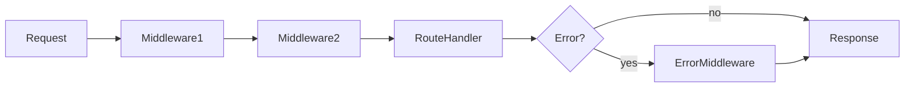

# Lesson 3: Middleware

## Learning Objectives

By the end of this lesson, you will be able to:
- Explain what middleware is and how the Express pipeline works
- Use built-in middleware (`express.json`, `express.urlencoded`)
- Add third-party middleware (CORS, security headers)
- Write custom middleware for logging and auth checks
- Implement error-handling middleware correctly (signature + placement)

## Why Middleware Matters

Express is fundamentally a middleware pipeline.

Middleware lets you add cross-cutting behavior:
- parse request bodies
- log requests
- enforce auth
- handle errors consistently



## What is Middleware?

A middleware function can access:
- `req` (request)
- `res` (response)
- `next` (a function that hands control to the next middleware/handler)

If middleware does **not** call `next()` or send a response, the request will “hang”.

## Basic Middleware (Logger)

```typescript
app.use((req, res, next) => {
  console.log(`${req.method} ${req.path}`);
  next(); // pass control onward
});
```

### Why this is useful

Even simple logging is valuable for debugging and production observability.

## Body Parsing Middleware

### JSON Parser

```typescript
app.use(express.json()); // Parse JSON bodies
```

If you don’t add this, `req.body` will often be `undefined` for JSON requests.

### URL-encoded Parser

```typescript
app.use(express.urlencoded({ extended: true })); // Parse form bodies
```

Useful for HTML form submissions (less common in API-only services).

## CORS Middleware

Browsers enforce CORS for cross-origin requests. If your frontend runs on `localhost:3000`
and backend runs on `localhost:3001`, you typically need CORS configured.

```typescript
import cors from "cors";

app.use(
  cors({
    origin: process.env.CORS_ORIGIN || "http://localhost:3000",
    credentials: true,
  })
);
```

### Important note

If you use cookie-based auth, `credentials: true` (and correct cookie settings) matter.

## Security Middleware

`helmet` sets helpful HTTP security headers.

```typescript
import helmet from "helmet";

app.use(helmet());
```

## Custom Middleware (Typed)

Custom middleware often benefits from TypeScript types:

```typescript
import type { NextFunction, Request, Response } from "express";

function logger(req: Request, res: Response, next: NextFunction) {
  console.log(`${new Date().toISOString()} - ${req.method} ${req.path}`);
  next();
}

app.use(logger);
```

## Error-Handling Middleware (Critical)

Error middleware has a special signature with **4 parameters**:

```typescript
import type { NextFunction, Request, Response } from "express";

app.use((err: Error, req: Request, res: Response, next: NextFunction) => {
  console.error(err);
  res.status(500).json({ error: "Internal server error" });
});
```

### Placement matters

Error middleware should be registered **after** routes, so it can catch errors from them.

## Real-World Scenario: Auth Middleware

Many APIs use middleware for auth checks:
- read token from `Authorization` header
- validate token
- attach `req.user`
- call `next()` or return 401/403

You’ll build toward this pattern in the auth/security level.

## Best Practices

### 1) Keep middleware ordered and intentional

Order matters:
- body parsing must happen before handlers that read `req.body`
- auth should happen before protected routes
- error middleware should be last

### 2) Prefer small, focused middleware

One job per middleware makes debugging easier.

### 3) Always terminate or call `next()`

If you neither send a response nor call `next()`, requests will hang.

## Common Pitfalls and Solutions

### Pitfall 1: `req.body` is undefined

**Problem:** JSON parser middleware is missing.

**Solution:** Add `app.use(express.json())` near the top.

### Pitfall 2: Error middleware never runs

**Problem:** It was registered before routes, or you didn’t call `next(err)`.

**Solution:** Register error middleware after routes; propagate errors properly.

### Pitfall 3: CORS issues in the browser

**Problem:** The browser blocks your request.

**Solution:** Configure CORS with the correct origin and credentials settings.

## Troubleshooting

### Issue: Request “hangs” (never completes)

**Symptoms:**
- browser spins forever

**Solutions:**
1. Ensure your middleware calls `next()` or returns a response.
2. Ensure your route handler sends a response in all branches.

### Issue: Preflight `OPTIONS` requests failing

**Symptoms:**
- CORS errors in browser

**Solutions:**
1. Ensure CORS middleware is installed and configured.
2. Ensure the backend allows required headers/methods.

## Next Steps

Now that you understand middleware:

1. ✅ **Practice**: Add a request logger middleware and confirm it logs each request
2. ✅ **Experiment**: Add a simple auth check middleware (deny requests without a header)
3. 📖 **Next Level**: Move into database integration with Prisma
4. 💻 **Complete Exercises**: Work through [Exercises 01](./exercises-01.md)

## Additional Resources

- [Express Docs: Using middleware](https://expressjs.com/en/guide/using-middleware.html)
- [Helmet Docs](https://helmetjs.github.io/)
- [CORS Docs](https://github.com/expressjs/cors)

---

**Key Takeaways:**
- Middleware is an ordered pipeline; order and placement matter.
- Use built-in middleware for parsing (`express.json`) and third-party middleware for CORS/security.
- Error-handling middleware requires a 4-argument signature and should be registered last.
