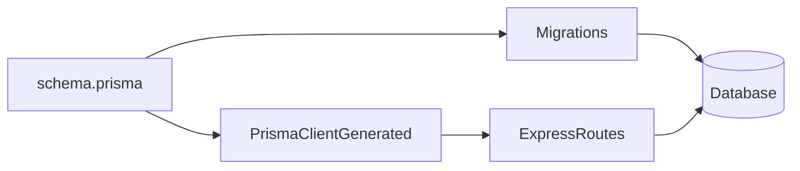

# Lesson 1: Prisma Setup (Long-form Enhanced)

> Prisma is where “toy APIs” become real systems: schema, migrations, and type-safe queries. This lesson is long-form so it can double as a reference chapter when you hit database problems later.

## Table of Contents

- What Prisma is (and what it is not)
- Schema as source of truth (`schema.prisma`)
- Prisma Client generation and singleton patterns
- Migrations: dev vs prod (and what can go wrong)
- Environment variables (`DATABASE_URL`) and common misconfigurations
- Advanced topics: seeding, resetting safely, transactions (preview), and error codes
- Troubleshooting checklist

## Learning Objectives

By the end of this lesson, you will be able to:
- Explain what Prisma is and why it’s useful in a TypeScript backend
- Define a basic Prisma schema and generate Prisma Client
- Run migrations safely in development and production
- Create a reusable Prisma Client instance (and avoid connection storms)
- Recognize common pitfalls (multiple Prisma clients, schema drift, wrong `DATABASE_URL`)

## Why Prisma Matters

Prisma gives you:
- a declarative schema (`schema.prisma`)
- type-safe database queries via Prisma Client
- migrations to evolve your database over time

This reduces “stringly-typed SQL” bugs and makes refactors safer.



## Prisma Schema (`schema.prisma`)

Define your database schema in `prisma/schema.prisma`:

```prisma
model User {
  id        Int      @id @default(autoincrement())
  email     String   @unique
  name      String
  createdAt DateTime @default(now())
}
```

### Key ideas

- Prisma models map to tables
- fields map to columns
- attributes like `@id`, `@unique`, `@default(...)` define constraints/defaults

## Generating Prisma Client

After schema changes, generate the client:

```bash
npx prisma generate
```

This creates typed query helpers based on your schema.

## Using Prisma Client in Code

```typescript
import { PrismaClient } from "@prisma/client";

const prisma = new PrismaClient();

const users = await prisma.user.findMany();
```

### Production note: don’t create new clients per request

Creating a new Prisma Client (and DB connection pool) repeatedly can exhaust DB connections.
Prefer a singleton/shared instance.

## Recommended Pattern: Prisma Singleton (Node)

```typescript
import { PrismaClient } from "@prisma/client";

const globalForPrisma = globalThis as unknown as { prisma?: PrismaClient };

export const prisma =
  globalForPrisma.prisma ??
  new PrismaClient({
    log: process.env.NODE_ENV === "development" ? ["query", "error", "warn"] : ["error"],
  });

if (process.env.NODE_ENV !== "production") globalForPrisma.prisma = prisma;
```

This pattern avoids multiple instances during hot reload in development.

## Database Migrations

### Development workflow

```bash
# create migration + apply to local DB
npx prisma migrate dev --name init
```

### Production workflow

```bash
# apply existing migrations (created in dev/CI)
npx prisma migrate deploy
```

### Why we separate dev vs prod

- `migrate dev` can create migrations interactively and reset dev DBs
- `migrate deploy` is designed for production-safe application of existing migrations

## Real-World Scenario: Schema Changes Over Time

You’ll routinely:
1. add a field (e.g., `updatedAt`)
2. generate a migration
3. deploy migration safely
4. use new field in queries

Prisma keeps schema, code, and DB aligned.

## Best Practices

### 1) Treat `schema.prisma` as source of truth

Keep it reviewed like code—schema changes are product changes.

### 2) Use migrations for all DB changes

Avoid “manual” DB edits that create drift between environments.

### 3) Use a single Prisma Client instance

Prevent connection storms and hard-to-debug production issues.

## Common Pitfalls and Solutions

### Pitfall 1: Forgetting to generate Prisma Client

**Problem:** Types don’t match schema changes, or runtime errors occur.

**Solution:** Run `npx prisma generate` (often after migrations too).

### Pitfall 2: Wrong `DATABASE_URL`

**Problem:** You migrate/query a different database than you expect.

**Solution:** Confirm `.env` and environment variables match the intended environment.

### Pitfall 3: Multiple Prisma clients

**Problem:** DB “too many connections” errors.

**Solution:** Use the singleton pattern and avoid creating Prisma inside request handlers.

## Troubleshooting

### Issue: "Prisma schema validation" errors

**Symptoms:**
- Prisma complains about schema syntax/attributes

**Solutions:**
1. Fix schema syntax (types, attributes).
2. Re-run `prisma format` (optional) and generate again.

### Issue: Migrations fail or database is out of sync

**Symptoms:**
- migrate errors, missing tables/columns

**Solutions:**
1. Check `DATABASE_URL`.
2. Inspect migration history (`prisma migrate status`).
3. In dev, consider resetting the database if appropriate (be careful).

---

## Advanced Topics (Reference)

### 1) `.env` and `DATABASE_URL`: the #1 source of “it works on my machine”

Prisma reads `DATABASE_URL` to know which database to migrate/query.

Typical failure modes:
- you changed `.env` but didn’t restart the dev server
- you have multiple `.env` files and the wrong one is loaded
- you have multiple terminals and they’re using different environment variables
- you’re pointing at a production DB from dev by accident (dangerous)

Practical habit:
- treat `DATABASE_URL` as a “power tool”
- print it in development logs only if it’s safe (never in production logs)

### 2) Seeding (preview)

Seeding is how you create predictable local data for development/testing.

Typical approaches:
- a `prisma/seed.ts` script that inserts a few users/posts
- idempotent seeds (safe to run multiple times)

Even if you don’t implement seeding yet, design your schema so you *can* seed it.

### 3) Resetting databases (dev-only, be careful)

In development, you may reset when you break migrations or need clean state.
In production, resets are catastrophic.

Know the intent difference:
- “reset dev state” is a valid workflow
- “reset prod state” is usually data loss

### 4) Connection management (why the singleton pattern matters)

In Node.js, creating Prisma clients repeatedly can:
- exhaust DB connections
- cause intermittent timeouts under load

The singleton pattern shown earlier is a baseline defense.

### 5) Prisma error codes (preview for later lessons)

Real systems map database errors into stable API errors.

Examples you’ll encounter:
- unique constraint violations (e.g. duplicate email) → typically 409
- foreign key violations → typically 400 or 404 depending on meaning

You don’t need to memorize codes now, but you should know:
> You should not return raw DB errors to clients. Translate them into stable, safe API responses.

## Expanded troubleshooting quick hits

### Issue: `prisma generate` runs but TypeScript types don’t update

**Fixes:**
1. Restart TypeScript server / dev process
2. Ensure you’re importing from `@prisma/client` generated in this workspace

### Issue: “Too many connections”

**Fixes:**
1. Ensure you’re not creating PrismaClient inside request handlers
2. Use the singleton pattern and reuse one instance per process

## Next Steps

Now that Prisma is set up:

1. ✅ **Practice**: Add an `updatedAt` field and migrate
2. ✅ **Experiment**: Generate client and run a simple `findMany`
3. 📖 **Next Lesson**: Learn about [Prisma Queries](./lesson-02-queries.md)
4. 💻 **Complete Exercises**: Work through [Exercises 02](./exercises-02.md)

## Additional Resources

- [Prisma Docs: Getting Started](https://www.prisma.io/docs/getting-started)
- [Prisma Docs: Migrate](https://www.prisma.io/docs/concepts/components/prisma-migrate)

---

**Key Takeaways:**
- Prisma provides schema + migrations + type-safe queries.
- Generate Prisma Client after schema changes.
- Use `migrate dev` in development and `migrate deploy` in production.
- Use a singleton Prisma Client to avoid DB connection issues.
