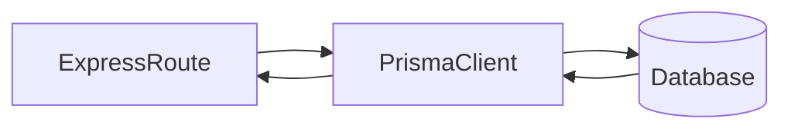

# Lesson 2: Prisma Queries

## Learning Objectives

By the end of this lesson, you will be able to:
- Perform common Prisma operations: `findMany`, `findUnique`, `create`, `update`, `delete`
- Filter, sort, and paginate query results
- Select only needed fields (and avoid leaking sensitive data)
- Handle errors and “not found” cases correctly in an API
- Recognize common pitfalls (using `findUnique` incorrectly, assuming updates always succeed)

## Why Queries Matter

Your API ultimately needs to:
- read from the database
- write to the database
- return correct HTTP responses

Prisma gives you a consistent API for these operations, and TypeScript helps you keep queries and models aligned.



## `findMany` (List Records)

```typescript
const users = await prisma.user.findMany();
```

### Filtering, sorting, pagination

```typescript
const users = await prisma.user.findMany({
  where: { email: { contains: "@example.com" } },
  orderBy: { createdAt: "desc" },
  take: 20,
  skip: 0,
});
```

## `findUnique` (Fetch One by Unique Field)

Use `findUnique` with a unique constraint (like `id` or `email`).

```typescript
const user = await prisma.user.findUnique({
  where: { id: 1 },
});
```

### Handling not found

`findUnique` returns `null` if nothing matches:

```typescript
if (!user) {
  // respond 404 in your API layer
}
```

## `create` (Insert Record)

```typescript
const user = await prisma.user.create({
  data: {
    email: "alice@example.com",
    name: "Alice",
  },
});
```

### Validation reminder

Prisma enforces schema constraints, but you should still validate request input before calling the DB.

## `update` (Modify Record)

```typescript
const user = await prisma.user.update({
  where: { id: 1 },
  data: { name: "Alice Updated" },
});
```

### Important behavior

If the record doesn’t exist, `update` throws an error (it does not return `null`).
Many APIs check existence first, or catch and translate the error to a 404.

## `delete` (Remove Record)

```typescript
await prisma.user.delete({
  where: { id: 1 },
});
```

`delete` also throws if the record doesn’t exist.

## Selecting Fields (Avoid Leaking Secrets)

If your model contains sensitive fields (like `passwordHash`), never return them from your API.

```typescript
const users = await prisma.user.findMany({
  select: { id: true, email: true, name: true, createdAt: true },
});
```

## Real-World Scenario: Building CRUD Endpoints

Typical pattern in an Express handler:
- validate input
- call Prisma
- return typed JSON + correct status code
- translate errors into stable API errors

## Best Practices

### 1) Return consistent response shapes

Decide whether you return raw objects or `{ data: ... }` envelopes and stick to it.

### 2) Handle “not found” explicitly

Use 404 when a resource isn’t found; don’t return 200 with `null`.

### 3) Avoid overfetching

Use `select` to return only fields you need.

## Common Pitfalls and Solutions

### Pitfall 1: Using `findUnique` with a non-unique filter

**Problem:** You try `findUnique` on a non-unique field; Prisma rejects it.

**Solution:** Use `findFirst` or `findMany` for non-unique filters.

### Pitfall 2: Assuming `update` returns `null` when missing

**Problem:** You expect “not found” to return null, but Prisma throws.

**Solution:** Check existence first or catch and translate the error.

### Pitfall 3: Returning full user objects

**Problem:** You accidentally leak sensitive fields.

**Solution:** Use `select` and define DTO types for responses.

## Troubleshooting

### Issue: Unique constraint errors

**Symptoms:**
- errors when creating/updating unique fields (email)

**Solutions:**
1. Check if the record exists first (409 conflict).
2. Catch the Prisma error and return a stable API error response.

### Issue: Query returns empty results

**Symptoms:**
- `findMany` returns `[]`

**Solutions:**
1. Confirm your filters are correct.
2. Confirm you’re connected to the expected database (`DATABASE_URL`).

## Next Steps

Now that you can query with Prisma:

1. ✅ **Practice**: Implement list + detail endpoints with `findMany`/`findUnique`
2. ✅ **Experiment**: Add `select` to avoid overfetching
3. 📖 **Next Lesson**: Learn about [Relationships](./lesson-03-relationships.md)
4. 💻 **Complete Exercises**: Work through [Exercises 02](./exercises-02.md)

## Additional Resources

- [Prisma Docs: Prisma Client](https://www.prisma.io/docs/concepts/components/prisma-client)
- [Prisma Docs: Filtering and Sorting](https://www.prisma.io/docs/concepts/components/prisma-client/filtering-and-sorting)

---

**Key Takeaways:**
- Prisma operations cover CRUD: find, create, update, delete.
- `findUnique` returns `null` when missing; `update/delete` typically throw when missing.
- Use filters, ordering, and pagination for real endpoints.
- Use `select` to avoid leaking sensitive data and to reduce overfetching.
