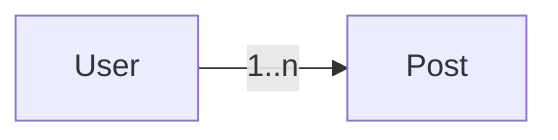

# Lesson 3: Relationships (Long-form Enhanced)

> Relationships are where database design, API design, and performance meet. This long-form lesson adds advanced patterns like nested writes, referential actions, and avoiding overfetching/N+1 issues.

## Table of Contents

- Relationship basics (foreign keys vs relation fields)
- Querying relations (`include` vs `select`)
- Creating related records (connect vs nested writes)
- Advanced topics: referential actions, nested updates, and transaction boundaries
- Troubleshooting checklist

## Learning Objectives

By the end of this lesson, you will be able to:
- Define one-to-many relationships in Prisma schema
- Understand relation fields vs foreign keys (`userId` vs `user`)
- Query related data using `include` and `select`
- Avoid common performance and security pitfalls (overfetching, leaking fields)
- Recognize common relationship issues (missing foreign key, incorrect relation definitions)

## Why Relationships Matter

Most real systems have relational data:
- users → posts
- orders → line items
- teams → members

Relationships let you model and query these connections safely.



## One-to-Many Relationship (Schema)

```prisma
model User {
  id    Int    @id @default(autoincrement())
  posts Post[]
}

model Post {
  id     Int  @id @default(autoincrement())
  userId Int
  user   User @relation(fields: [userId], references: [id])
}
```

### What each field means

- `userId`: the actual foreign key column on `Post`
- `user`: the relation field used by Prisma for navigating the relationship
- `posts`: the “back relation” array on `User`

## Querying Relations with `include`

Use `include` to fetch related records:

```typescript
const user = await prisma.user.findUnique({
  where: { id: 1 },
  include: { posts: true },
});
```

### Prefer `select` when you don’t need everything

```typescript
const user = await prisma.user.findUnique({
  where: { id: 1 },
  select: {
    id: true,
    email: true,
    posts: {
      select: { id: true, title: true },
    },
  },
});
```

This reduces payload size and avoids leaking fields.

## Creating Related Records

You can create a post referencing a user via `userId`:

```typescript
const post = await prisma.post.create({
  data: {
    title: "Hello",
    userId: 1,
  },
});
```

Or via nested writes (connect):

```typescript
const post = await prisma.post.create({
  data: {
    title: "Hello",
    user: { connect: { id: 1 } },
  },
});
```

## Real-World Scenario: API Responses with Relations

Common API decision:
- return posts with author info
- but only select safe author fields (not password hashes)

```typescript
const posts = await prisma.post.findMany({
  include: {
    user: {
      select: { id: true, email: true },
    },
  },
});
```

## Best Practices

### 1) Be intentional about `include`

`include: { posts: true }` is convenient but can overfetch.

### 2) Avoid N+1 patterns

Fetch relations in one query where possible instead of querying in loops.

### 3) Validate foreign keys

Before creating a related record, confirm the parent exists (or handle FK errors cleanly).

## Common Pitfalls and Solutions

### Pitfall 1: Overfetching

**Problem:** You return full user + all posts fields when only titles are needed.

**Solution:** Use `select` and pick only required fields.

### Pitfall 2: Missing back relation

**Problem:** You define `userId` but forget the `posts` relation on `User` (or define it incorrectly).

**Solution:** Keep both sides consistent and run `prisma generate` to catch schema errors.

### Pitfall 3: Confusing foreign key vs relation field

**Problem:** You try to assign `user: 1` instead of `userId: 1` or `user: { connect: ... }`.

**Solution:** Use either `userId` or nested `connect`.

## Troubleshooting

### Issue: Relation query returns `null`/empty unexpectedly

**Symptoms:**
- `include` returns no related records

**Solutions:**
1. Confirm the related rows exist in the database.
2. Confirm the foreign key value matches the parent id.
3. Confirm your schema relation fields are correct and migrations are applied.

### Issue: Foreign key constraint errors

**Symptoms:**
- create fails due to missing parent record

**Solutions:**
1. Validate parent existence before create.
2. Return a clear API error (404 for missing parent, 400 for invalid id).

---

## Advanced Relationship Patterns (Reference)

### 1) `include` vs `select` (performance + security)

- `include` is convenient, but can easily overfetch and accidentally return sensitive fields from related models.
- `select` is more explicit and is usually safer for APIs.

Rule of thumb:
> For API responses, prefer `select` unless you truly need full related objects.

### 2) Nested writes (create/connect) and when to use them

Two ways to link records:

- Set a foreign key directly (`userId`)
- Use nested writes (`connect`, `create`) through the relation field

```typescript
// Connect an existing user when creating a post
await prisma.post.create({
  data: {
    title: "Hello",
    user: { connect: { id: 1 } },
  },
});
```

Nested writes are useful when you want:
- one request/transaction to create a graph of data
- fewer “manual” steps in application code

### 3) Transactions around multi-step relationship changes

If you need to update multiple tables consistently, wrap them:

```typescript
await prisma.$transaction(async (tx) => {
  const user = await tx.user.update({ where: { id: 1 }, data: { name: "Updated" } });
  await tx.post.create({ data: { title: "New Post", userId: user.id } });
});
```

### 4) Referential actions (delete behavior)

In real applications you must decide what happens when a parent is deleted:
- restrict delete (error if children exist)
- cascade delete (delete children too)
- set null (detach children)

The exact Prisma schema options depend on your database and relation setup, but the *design question* is universal:
> What is the correct business behavior when a referenced record is removed?

### 5) Avoiding N+1 in APIs

If you return a list of posts with authors:
- don’t query the author in a loop
- fetch relations in the query with `include/select`

```typescript
const posts = await prisma.post.findMany({
  select: {
    id: true,
    title: true,
    user: { select: { id: true, email: true } },
  },
});
```

## Next Steps

Now that you understand relationships:

1. ✅ **Practice**: Add a `Post` model related to `User`
2. ✅ **Experiment**: Return posts with author info using `select`
3. 📖 **Next Level**: Continue to API development patterns
4. 💻 **Complete Exercises**: Work through [Exercises 02](./exercises-02.md)

## Additional Resources

- [Prisma Docs: Relations](https://www.prisma.io/docs/concepts/components/prisma-schema/relations)
- [Prisma Docs: Relation Queries](https://www.prisma.io/docs/concepts/components/prisma-client/relation-queries)

---

**Key Takeaways:**
- Relationships are defined with foreign keys + relation fields.
- Use `include` for convenience and `select` for control and safety.
- Prefer selecting safe fields when returning related objects from an API.
- Validate foreign keys and avoid overfetching/N+1 query patterns.
