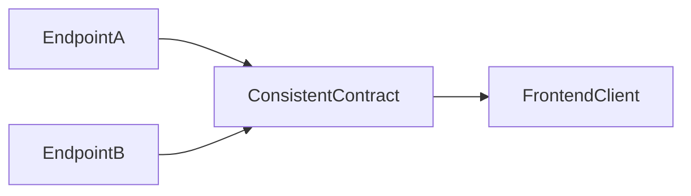

# Lesson 3: Response Formatting (Long-form Enhanced)

> Response formatting is where you turn a bunch of endpoints into a coherent API. This long-form lesson adds contract patterns used in production: error codes, pagination metadata, and correlation ids.

## Table of Contents

- Why consistency matters (client simplicity)
- Success and error envelopes (and trade-offs)
- Pagination responses and metadata
- Error hygiene (no stack traces, stable messages)
- Advanced topics: error codes, request ids, and backwards compatibility
- Troubleshooting checklist

## Learning Objectives

By the end of this lesson, you will be able to:
- Explain why consistent response shapes matter for clients
- Implement a stable success/error envelope
- Return appropriate status codes with consistent JSON bodies
- Design paginated responses (data + metadata)
- Recognize common pitfalls (inconsistent shapes, leaking stack traces, ambiguous errors)

## Why Response Formatting Matters

Your API is a contract. A consistent response format:
- makes frontend code simpler
- improves debuggability
- reduces “special case” handling across endpoints



## A Consistent Response Envelope

One common pattern is a success/error envelope:

```typescript
import type { Response } from "express";

export interface ApiResponse<T> {
  success: boolean;
  data?: T;
  error?: string;
}

export function sendSuccess<T>(res: Response, data: T, status = 200) {
  res.status(status).json({ success: true, data } satisfies ApiResponse<T>);
}

export function sendError(res: Response, error: string, status = 500) {
  res.status(status).json({ success: false, error } satisfies ApiResponse<never>);
}
```

### Why this helps

Clients can consistently check:
- `success === true` → read `data`
- `success === false` → read `error`

## What About REST Returning “Raw” Resources?

Many APIs return raw resources without an envelope:
- `GET /users` returns `User[]`

That’s valid too. The key is consistency:
- choose a pattern
- apply it across endpoints

This course leans toward using a consistent envelope for teaching clarity.

## Error Response Guidelines

When you return an error:
- use a correct status code
- return a stable JSON shape
- avoid leaking internal stack traces in production

Example:

```typescript
sendError(res, "User not found", 404);
```

## Pagination

Pagination responses should include metadata:

```typescript
export interface PaginatedResponse<T> {
  data: T[];
  page: number;
  limit: number;
  total: number;
}
```

### Example: paginated envelope

```typescript
export interface ApiPaginatedResponse<T> extends ApiResponse<PaginatedResponse<T>> {}
```

In practice, you might return:
- `data`: current page items
- `page`, `limit`
- `total`: total items (for UI pagination)

## Real-World Scenario: Frontend Consuming Errors

If all errors look the same, the frontend can:
- show a toast/banner with `error`
- handle 401/403 by redirecting to login
- handle 404 by showing a “not found” page

## Best Practices

### 1) Keep responses stable

Don’t change response shapes casually—clients will break.

### 2) Use correct status codes

Status codes + response shape give clients clear semantics.

### 3) Centralize response helpers

Use shared helpers so every handler returns consistent results.

## Common Pitfalls and Solutions

### Pitfall 1: Inconsistent error formats

**Problem:** One route returns `{ error: "x" }`, another returns `{ message: "x" }`.

**Solution:** Use shared helpers (`sendError`) everywhere.

### Pitfall 2: Returning 200 with an error body

**Problem:** Clients can’t tell success vs failure reliably.

**Solution:** Use 4xx/5xx codes appropriately.

### Pitfall 3: Leaking stack traces

**Problem:** Exposing internals to clients in production.

**Solution:** Log details server-side; return safe messages client-side.

## Troubleshooting

### Issue: Frontend error handling is messy

**Symptoms:**
- lots of special casing per endpoint

**Solutions:**
1. Standardize response shape across endpoints.
2. Standardize status codes for common outcomes.

### Issue: Pagination UI is incorrect

**Symptoms:**
- “next page” buttons don’t know when to stop

**Solutions:**
1. Include `total` (and/or `hasNextPage`) in the response metadata.
2. Keep `page` and `limit` consistent and validated.

---

## Advanced Response Contract Patterns (Reference)

### 1) Stable error codes (not just messages)

Messages are for humans; codes are for clients.

Example approach:

```typescript
export type ErrorCode =
  | "VALIDATION_FAILED"
  | "UNAUTHORIZED"
  | "FORBIDDEN"
  | "NOT_FOUND"
  | "CONFLICT"
  | "INTERNAL";

export interface ApiErrorBody {
  success: false;
  error: string;
  code: ErrorCode;
  details?: unknown;
}
```

Why it helps:
- frontends can branch on `code` instead of fragile string matching

### 2) Correlation / request ids

If you include `x-request-id` in responses, you can correlate user reports with server logs.

Typical pattern:
- middleware generates/propagates a request id
- response includes it as a header
- errors may also include it in the JSON body in development

### 3) Backwards compatibility (response evolution)

Changing response shapes breaks clients.

Safe evolution strategies:
- add new fields (non-breaking)
- avoid renaming/removing fields without versioning
- keep error shapes stable

### 4) Pagination metadata: pick a clear contract

Offset pagination (page/limit/total) is simple and UI-friendly:

```json
{
  "success": true,
  "data": {
    "data": [],
    "page": 1,
    "limit": 20,
    "total": 123
  }
}
```

Cursor pagination is often better for large datasets but changes the UI logic. If you adopt cursor pagination:
- return `nextCursor`
- don’t promise stable page numbers

### 5) Avoid leaking internals in errors

Even with a consistent envelope:
- don’t send stack traces to clients in production
- log details server-side

Practical rule:
> Error responses should be safe, stable, and actionable for the client—not a debug dump.

## Next Steps

Now that you understand response formatting:

1. ✅ **Practice**: Add `sendSuccess` and `sendError` helpers and use them in 2 routes
2. ✅ **Experiment**: Add pagination metadata to a list endpoint
3. 📖 **Next Level**: Move into authentication and security
4. 💻 **Complete Exercises**: Work through [Exercises 03](./exercises-03.md)

## Additional Resources

- [MDN: HTTP status codes](https://developer.mozilla.org/en-US/docs/Web/HTTP/Status)
- [Google JSON Style Guide](https://google.github.io/styleguide/jsoncstyleguide.xml)

---

**Key Takeaways:**
- Consistent response shapes make clients simpler and reduce bugs.
- Use shared helpers to enforce consistency across endpoints.
- Combine correct status codes with stable JSON bodies.
- Paginated endpoints should include metadata (page, limit, total).
