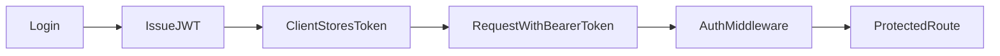

# Lesson 1: JWT Authentication (Long-form Enhanced)

> This is the “course version” of JWT auth. For the full reference-grade walkthrough (more code, more visuals, more edge cases), see: [JWT Authentication (Enhanced Example)](./lesson-01-jwt-authentication-ENHANCED-EXAMPLE.md).

## Table of Contents

- JWT fundamentals and trade-offs
- Issuing tokens (claims, expiration)
- Verifying tokens + attaching auth context
- Common pitfalls and security gotchas
- Troubleshooting
- Advanced patterns: refresh tokens, revocation, storage, rotation

## Learning Objectives

By the end of this lesson, you will be able to:
- Explain what JWTs are and what “stateless auth” means
- Generate JWTs securely with correct claims and expiration
- Verify JWTs and attach auth context to requests via middleware
- Understand common security pitfalls (weak secrets, long expirations, trusting decoded payload blindly)
- Distinguish authentication (who you are) from authorization (what you can do)

## Why JWT Authentication Matters

JWTs (JSON Web Tokens) are a common way to authenticate API requests when:
- you have multiple clients (web, mobile)
- you want stateless auth (no server session store required)

But JWTs come with trade-offs and require careful implementation.



## JWT Basics (Practical)

A JWT typically includes:
- a header (algorithm, token type)
- a payload (claims like `userId`, `role`, `exp`)
- a signature (proves integrity)

JWTs are **not encrypted by default**. Anyone who has the token can read the payload. Don’t store secrets in it.

## Generating Tokens

```typescript
import jwt from "jsonwebtoken";

const token = jwt.sign(
  { userId: user.id },
  process.env.JWT_SECRET!,
  { expiresIn: "7d" }
);
```

### What to include in payload

Include minimal, stable claims:
- `userId`
- maybe `role` (if it rarely changes)

Avoid putting large user objects in tokens.

### Expiration

Shorter expirations reduce risk if a token is stolen, but can require refresh strategies.

## Verifying Tokens

```typescript
const decoded = jwt.verify(token, process.env.JWT_SECRET!);
```

### Important: treat decoded as untrusted until typed

`jwt.verify` returns `string | object` depending on token. You should validate/shape-check it before using fields.

## Auth Middleware (Bearer Token)

This middleware:
- reads `Authorization: Bearer <token>`
- verifies it
- attaches decoded claims to the request

```typescript
import type { NextFunction, Request, Response } from "express";
import jwt from "jsonwebtoken";

type JwtPayload = { userId: number; role?: string };

export function authenticate(req: Request, res: Response, next: NextFunction) {
  const header = req.headers.authorization;
  const token = header?.startsWith("Bearer ") ? header.slice("Bearer ".length) : undefined;

  if (!token) return res.status(401).json({ error: "Unauthorized" });

  try {
    const decoded = jwt.verify(token, process.env.JWT_SECRET!);
    if (typeof decoded !== "object" || decoded === null || !("userId" in decoded)) {
      return res.status(401).json({ error: "Invalid token" });
    }

    // Attach minimal auth context (you can also look up the full user in DB)
    (req as any).user = decoded as JwtPayload;
    return next();
  } catch {
    return res.status(401).json({ error: "Invalid token" });
  }
}
```

## Real-World Scenario: “Who am I?” Endpoint

Common pattern:
- client stores token
- client calls `/me` with bearer token
- backend verifies token and returns current user profile

This keeps tokens small but still lets UI fetch fresh user data.

## Best Practices

### 1) Use a strong secret and rotate carefully

JWT secret must be long, random, and stored securely (env var / secret manager).

### 2) Keep JWT payload minimal

Tokens are readable; store IDs/claims, not sensitive data.

### 3) Validate auth on every protected request

JWT-based auth is only “stateless” if you verify each request.

## Common Pitfalls and Solutions

### Pitfall 1: No expiration (or extremely long expiration)

**Problem:** Stolen tokens remain valid for too long.

**Solution:** Use `expiresIn`, and consider refresh strategies for long-lived sessions.

### Pitfall 2: Trusting the decoded payload blindly

**Problem:** You assume decoded has fields; runtime errors happen or logic is bypassed.

**Solution:** Validate shape (or use a schema validator) and attach minimal typed context.

### Pitfall 3: Putting secrets in JWT payload

**Problem:** Anyone can base64-decode the payload.

**Solution:** Never store secrets; use server-side lookup for sensitive data.

## Troubleshooting

### Issue: Every request returns 401

**Symptoms:**
- token is missing or fails verification

**Solutions:**
1. Confirm client sends `Authorization: Bearer <token>`.
2. Confirm `JWT_SECRET` matches between issuing and verifying.
3. Confirm token hasn’t expired.

### Issue: Middleware sets user but downstream code can’t read it

**Symptoms:**
- `req.user` is undefined in handlers

**Solutions:**
1. Ensure middleware runs before protected routes (`app.use(authenticate)` or per-route usage).
2. Add proper request typing (advanced; can extend Express `Request` type).

---

## Advanced JWT Patterns (Reference)

### 1) Access tokens vs refresh tokens

In production systems, you usually split tokens into:
- **Access token**: short-lived (e.g., 15m–1h), sent on every request
- **Refresh token**: long-lived (e.g., 7–30d), used to obtain new access tokens

Why:
- stolen access tokens expire quickly
- refresh tokens can be stored and revoked more carefully (e.g., in DB)

### 2) Token revocation (the “stateless” trade-off)

JWTs are stateless **until** you need immediate revocation.

Common approaches:
- **Short expirations** for access tokens (primary mitigation)
- **Refresh token rotation** + server-side storage
- **Blacklist/denylist** (server-side storage; costs memory/ops)

### 3) Storage: cookie vs localStorage (security trade-offs)

- **HTTP-only cookies**: best defense against XSS token theft, but introduce CSRF considerations
- **localStorage**: easy for SPAs, but vulnerable to XSS token theft

Rule of thumb:
> If you can safely do cookie auth, prefer HTTP-only cookies + CSRF defenses.

### 4) Issuer/audience and clock skew

For stronger verification, use:
- `issuer` (`iss`) and `audience` (`aud`)
- small allowances for clock skew if needed

This prevents tokens minted for “another app” from being accepted by yours.

### 5) Algorithm confusion and safe defaults

In JWT libraries, avoid accepting unexpected algorithms.
Use a strong secret (or asymmetric keys) and verify with explicit expectations.

### 6) Key rotation (advanced)

In mature systems you rotate signing keys.
If you ever adopt asymmetric keys (RS256/ES256):
- publish a JWKS (public keys) for verification
- keep private keys secure and rotate on schedule

## Manual testing tips (Windows friendly)

In PowerShell, use `curl.exe` (not `curl` alias):

```bash
curl.exe -i http://localhost:3001/api/users/me -H "Authorization: Bearer YOUR_TOKEN"
```

### Test: expired/invalid token behavior

You want to confirm your API returns:
- **401** for missing/invalid/expired tokens
- a consistent error shape (so clients can handle it)

```bash
# Missing token
curl.exe -i http://localhost:3001/api/users/me

# Malformed token
curl.exe -i http://localhost:3001/api/users/me -H "Authorization: Bearer not-a-real-token"
```

## Next Steps

Now that you can authenticate requests:

1. ✅ **Practice**: Add login endpoint that returns a JWT
2. ✅ **Experiment**: Create a `/me` endpoint protected by `authenticate`
3. 📖 **Next Lesson**: Learn about [Password Hashing](./lesson-02-password-hashing.md)
4. 💻 **Complete Exercises**: Work through [Exercises 04](./exercises-04.md)

## Additional Resources

- [jsonwebtoken docs](https://github.com/auth0/node-jsonwebtoken)
- [OWASP: JWT Cheat Sheet](https://cheatsheetseries.owasp.org/cheatsheets/JSON_Web_Token_for_Java_Cheat_Sheet.html)

---

**Key Takeaways:**
- JWTs are a common stateless auth mechanism for APIs.
- Generate tokens with strong secrets and reasonable expirations.
- Verify tokens on every request and validate decoded payload shape.
- Keep payload minimal; don’t store secrets in JWTs.
