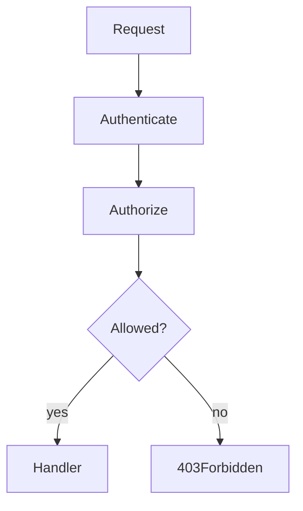

# Lesson 3: Authorization (Long-form Enhanced)

## Table of Contents

- Authorization vs authentication
- RBAC (roles) and ownership checks
- Combining checks safely (admin-or-owner)
- Troubleshooting
- Advanced patterns: permissions/scopes, policy-based auth, multi-tenancy, audit logging

## Learning Objectives

By the end of this lesson, you will be able to:
- Explain authorization vs authentication
- Implement role-based access control (RBAC) in Express middleware
- Implement resource ownership checks (“can only modify your own data”)
- Combine authentication + authorization correctly in route handlers
- Recognize common pitfalls (trusting client input, missing checks on sensitive routes)

## Why Authorization Matters

Authentication proves identity. Authorization enforces permissions.

Even if a user is logged in, they should not automatically have access to:
- admin endpoints
- other users’ private data
- destructive operations



## Role-Based Access Control (RBAC)

RBAC grants access based on a role claim (e.g., `admin`, `user`).

```typescript
import type { NextFunction, Request, Response } from "express";

function requireRole(role: string) {
  return (req: Request, res: Response, next: NextFunction) => {
    const user = (req as any).user as { role?: string } | undefined;
    if (!user?.role) return res.status(401).json({ error: "Unauthorized" });
    if (user.role !== role) return res.status(403).json({ error: "Forbidden" });
    return next();
  };
}

app.delete("/users/:id", authenticate, requireRole("admin"), deleteUser);
```

### Notes

- 401 means “not authenticated”
- 403 means “authenticated but not allowed”

## Resource Ownership (ABAC-style)

Ownership checks ensure users can only access/modify resources they own.

```typescript
import type { NextFunction, Request, Response } from "express";

function requireOwnership(req: Request, res: Response, next: NextFunction) {
  const user = (req as any).user as { userId?: number } | undefined;
  const id = Number(req.params.id);

  if (!user?.userId) return res.status(401).json({ error: "Unauthorized" });
  if (!Number.isFinite(id)) return res.status(400).json({ error: "Invalid id" });

  if (user.userId !== id) {
    return res.status(403).json({ error: "Forbidden" });
  }

  return next();
}
```

### Why this matters

Without ownership checks, a user could change `/users/123` to `/users/124` and modify someone else’s data.

## Combining RBAC + Ownership

Some routes allow:
- owners (user can modify themselves)
- admins (can modify anyone)

You can implement this as a single middleware:

```typescript
function requireAdminOrOwner(req: Request, res: Response, next: NextFunction) {
  const user = (req as any).user as { userId?: number; role?: string } | undefined;
  const id = Number(req.params.id);

  if (!user?.userId) return res.status(401).json({ error: "Unauthorized" });
  if (!Number.isFinite(id)) return res.status(400).json({ error: "Invalid id" });

  if (user.role === "admin" || user.userId === id) return next();
  return res.status(403).json({ error: "Forbidden" });
}
```

## Real-World Scenario: Protecting a Users API

Typical rules:
- any authenticated user can read their own profile
- only admins can list all users
- only admins or owners can update a user

## Best Practices

### 1) Always enforce authz on the backend

UI “protected routes” are not security.

### 2) Keep authorization close to the route

Make it obvious which endpoints require which permissions.

### 3) Use least privilege

Default to denying access unless explicitly allowed.

## Common Pitfalls and Solutions

### Pitfall 1: Trusting user-provided IDs

**Problem:** Client can choose any `:id`.

**Solution:** Compare `req.params.id` to authenticated identity (ownership) or role.

### Pitfall 2: Using 401 for everything

**Problem:** Client can’t distinguish “not logged in” vs “not allowed”.

**Solution:** Use 401 for missing/invalid auth; 403 for insufficient permissions.

### Pitfall 3: Authorization only on some routes

**Problem:** You secure delete but forget update, or secure UI but not API.

**Solution:** Apply consistent middleware patterns to all sensitive endpoints.

## Troubleshooting

### Issue: Admin endpoints always return 403

**Symptoms:**
- even admin users are blocked

**Solutions:**
1. Confirm the token/session includes a `role` claim (or you load role from DB).
2. Confirm middleware runs after authentication.

### Issue: Ownership check blocks legitimate users

**Symptoms:**
- user cannot update themselves

**Solutions:**
1. Ensure you compare the correct IDs (`userId` vs `id`).
2. Ensure route param parsing is correct (number vs string).

---

## Testing Authorization (Manual)

Assuming you have:
- a normal user token
- an admin user token

Test cases to prove your authz is correct:

```bash
# Normal user should NOT be able to delete arbitrary users
curl.exe -i -X DELETE http://localhost:3001/api/users/2 -H "Authorization: Bearer USER_TOKEN"

# Admin should be able to delete
curl.exe -i -X DELETE http://localhost:3001/api/users/2 -H "Authorization: Bearer ADMIN_TOKEN"

# Owner should be able to update themselves (if you implement admin-or-owner)
curl.exe -i -X PATCH http://localhost:3001/api/users/1 -H "Authorization: Bearer USER_TOKEN" -H "Content-Type: application/json" -d "{\"name\":\"New Name\"}"
```

What to verify:
- 401 when unauthenticated
- 403 when authenticated but forbidden
- 404 is reserved for “resource doesn’t exist” (don’t misuse it to hide auth issues unless intentional)

---

## Advanced Authorization Patterns (Reference)

### 1) Roles vs permissions (RBAC vs “scopes”)

Roles are coarse (“admin”, “user”). Permissions/scopes are finer (“users:read”, “users:delete”).

Many real systems evolve from RBAC → permission-based checks because:
- roles become too broad (“admin does everything”)
- teams need granular control per action/resource

### 2) Policy-based access control (PBAC)

Instead of sprinkling `if` statements everywhere, you centralize authorization rules:
- policies map actions → allowed conditions
- routes call `can(user, "update", resource)` style functions

Benefits:
- one place to review security rules
- easier testing of auth logic

### 3) Multi-tenancy (org/workspace boundaries)

If your system has organizations/workspaces, authorization must include tenant boundaries:
- a user in org A should not access org B data even if ids collide

Common pattern:
- derive `tenantId` from auth context
- include it in every query: `where: { id, tenantId }`

### 3b) Query-level authorization (recommended)

Instead of fetching a resource, then checking ownership, then updating, you can enforce ownership in the query:

```typescript
// Conceptual example: update only if record belongs to user
await prisma.post.updateMany({
  where: { id: postId, userId: req.user!.userId },
  data: { title: newTitle },
});
```

Benefits:
- fewer race conditions
- fewer places to forget a check

### 7) Don’t rely on “security by UI”

Frontend “protected routes” and hidden buttons are not security controls.
Authorization must be enforced server-side.

### 4) “Deny by default” and least privilege

Good security posture:
- default to denying access unless explicitly allowed
- add permissions intentionally

### 5) Audit logging for sensitive actions

For high-value operations (role changes, deletes, exports), log:
- who did it (user id)
- what changed
- when (timestamp)
- request id

This is invaluable during incident response.

### 6) Don’t trust client-provided ownership signals

Never authorize based on:
- `userId` fields sent in request bodies
- UI “admin mode” toggles

Always authorize based on:
- authenticated identity (`req.user`)
- server-validated resource ownership/tenant membership

## Next Steps

Now that you understand authorization:

1. ✅ **Practice**: Add `requireRole("admin")` to a destructive endpoint
2. ✅ **Experiment**: Implement `requireAdminOrOwner` and apply it to `PUT /users/:id`
3. 📖 **Next Level**: Move to validation and error handling
4. 💻 **Complete Exercises**: Work through [Exercises 04](./exercises-04.md)

## Additional Resources

- [OWASP: Access Control](https://cheatsheetseries.owasp.org/cheatsheets/Authorization_Cheat_Sheet.html)
- [NIST RBAC](https://csrc.nist.gov/projects/role-based-access-control)

---

**Key Takeaways:**
- Authorization enforces permissions; authentication proves identity.
- Use RBAC for role checks and ownership checks for resource-level security.
- Combine checks when needed (admin-or-owner).
- Always enforce authorization on backend routes.
