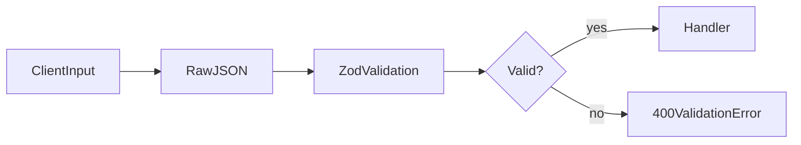

# Lesson 1: Input Validation

## Learning Objectives

By the end of this lesson, you will be able to:
- Explain why runtime validation is required even in TypeScript
- Validate request bodies using Zod
- Implement reusable validation middleware for Express routes
- Return clear 400 errors with helpful details (without leaking internals)
- Recognize common pitfalls (trusting TS types, validating too late, returning raw errors)

## Why Input Validation Matters

TypeScript types do **not** validate runtime inputs.

Anything coming from:
- HTTP requests
- environment variables
- files

is `unknown` in the real world and must be validated before use.



## Using Zod

Zod is a runtime schema validation library with great TypeScript integration.

```typescript
import { z } from "zod";

const createUserSchema = z.object({
  name: z.string().min(1),
  email: z.string().email(),
  age: z.number().int().positive().optional(),
});
```

### Parsing inside a route

```typescript
app.post("/users", (req, res) => {
  try {
    const data = createUserSchema.parse(req.body);
    // Process valid data
    res.status(201).json({ user: data });
  } catch (error) {
    res.status(400).json({ error: "Validation failed" });
  }
});
```

### Better: return Zod issues (carefully)

Returning the entire error object can be noisy. Prefer `ZodError.issues`.

## Validation Middleware (Recommended)

Validation is a cross-cutting concern, so middleware keeps routes clean.

```typescript
import type { NextFunction, Request, Response } from "express";
import type { z } from "zod";

function validateBody<TSchema extends z.ZodTypeAny>(schema: TSchema) {
  return (req: Request, res: Response, next: NextFunction) => {
    const result = schema.safeParse(req.body);
    if (!result.success) {
      return res.status(400).json({
        error: "Validation failed",
        details: result.error.issues,
      });
    }
    req.body = result.data;
    return next();
  };
}
```

Usage:

```typescript
app.post("/users", validateBody(createUserSchema), (req, res) => {
  // req.body is validated here
  res.status(201).json({ user: req.body });
});
```

## Real-World Scenario: Preventing Bad Data in Your Database

Without validation:
- empty emails get stored
- invalid ages crash downstream code
- your API behaves inconsistently

With validation:
- clients get clear 400 errors
- your DB stays cleaner
- your app is easier to reason about

## Best Practices

### 1) Validate at the boundary

Validate as close to the request entry as possible (middleware).

### 2) Use `safeParse` for control flow

It avoids try/catch and gives you clean success/failure branches.

### 3) Don’t leak internal error objects

Return helpful `issues`, not huge stack traces.

## Common Pitfalls and Solutions

### Pitfall 1: Assuming TypeScript types protect you

**Problem:** Runtime data can still be wrong.

**Solution:** Validate `req.body` at runtime with Zod (or equivalent).

### Pitfall 2: Validating after you already used the data

**Problem:** You access fields before validation, leading to crashes.

**Solution:** Validate first; then use the validated data.

### Pitfall 3: Returning raw error objects

**Problem:** Response includes confusing data or internal details.

**Solution:** Return `issues` (field-level errors) and a clear message.

## Troubleshooting

### Issue: Validation always fails

**Symptoms:**
- every request returns 400

**Solutions:**
1. Confirm `express.json()` middleware is enabled so `req.body` is parsed.
2. Confirm the client sends `Content-Type: application/json`.
3. Log `req.body` in development to confirm shape.

## Next Steps

Now that you can validate inputs:

1. ✅ **Practice**: Add a `createPostSchema` and validate post creation
2. ✅ **Experiment**: Return Zod issues and display them in a frontend form
3. 📖 **Next Lesson**: Learn about [Error Middleware](./lesson-02-error-middleware.md)
4. 💻 **Complete Exercises**: Work through [Exercises 05](./exercises-05.md)

## Additional Resources

- [Zod Docs](https://zod.dev/)
- [Express Docs: Error handling](https://expressjs.com/en/guide/error-handling.html)

---

**Key Takeaways:**
- TypeScript types don’t validate runtime input—schemas do.
- Validate request bodies at the boundary using middleware.
- Prefer `safeParse` and return structured field-level errors.
- Good validation improves UX, prevents bugs, and protects your database.
