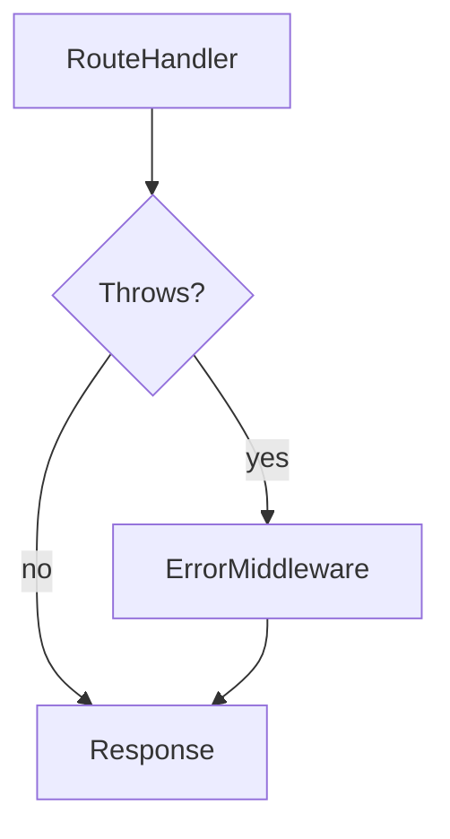

# Lesson 2: Error Middleware (Long-form Enhanced)

## Table of Contents

- Why centralized error handling matters
- Error middleware signature and placement
- Custom errors and predictable control flow
- Troubleshooting
- Advanced patterns: async errors, logging strategy, problem details, and safe production output

## Learning Objectives

By the end of this lesson, you will be able to:
- Explain how Express error-handling middleware works (4-arg signature)
- Centralize error handling so routes stay clean
- Translate known errors (validation, not found, auth) into correct HTTP responses
- Create custom error classes for predictable error control flow
- Recognize common pitfalls (throwing strings, leaking stack traces, swallowing errors)

## Why Error Middleware Matters

Without centralized error handling:
- every route repeats try/catch
- errors become inconsistent (some 500, some 200)
- debugging becomes harder

Error middleware gives you one place to:
- log errors
- decide status codes
- return a consistent error shape



## Error Handling Middleware (Signature)

Error middleware must have **four parameters**:

```typescript
app.use((err: Error, req: Request, res: Response, next: NextFunction) => {
  // ...
});
```

Express uses the 4-arg signature to recognize this as error middleware.

## Async route errors (must-have pattern)

If you use async route handlers, make sure rejections reach your error middleware.

```typescript
import type { NextFunction, Request, Response, RequestHandler } from "express";

export function asyncHandler(
  fn: (req: Request, res: Response, next: NextFunction) => Promise<unknown>
): RequestHandler {
  return (req, res, next) => {
    Promise.resolve(fn(req, res, next)).catch(next);
  };
}
```

Usage:

```typescript
app.get(
  "/boom",
  asyncHandler(async () => {
    throw new Error("Boom");
  })
);
```

## Handling Validation Errors (Zod)

```typescript
import type { NextFunction, Request, Response } from "express";
import { ZodError } from "zod";

app.use((err: unknown, req: Request, res: Response, next: NextFunction) => {
  console.error(err);

  if (err instanceof ZodError) {
    return res.status(400).json({
      error: "Validation error",
      details: err.issues,
    });
  }

  return res.status(500).json({ error: "Internal server error" });
});
```

### Why `unknown` is useful

Not every thrown value is an `Error`. Treating `err` as `unknown` forces you to narrow safely.

## Custom Error Classes (Predictable Errors)

Custom errors make it easy to throw and catch known conditions.

```typescript
export class AppError extends Error {
  constructor(
    public statusCode: number,
    message: string,
    public details?: unknown
  ) {
    super(message);
  }
}
```

Usage:

```typescript
throw new AppError(404, "User not found");
```

## Translating AppError in Middleware

```typescript
app.use((err: unknown, req: Request, res: Response, next: NextFunction) => {
  console.error(err);

  if (err instanceof AppError) {
    return res.status(err.statusCode).json({
      error: err.message,
      ...(err.details !== undefined ? { details: err.details } : {}),
    });
  }

  if (err instanceof ZodError) {
    return res.status(400).json({ error: "Validation error", details: err.issues });
  }

  return res.status(500).json({ error: "Internal server error" });
});
```

## Real-World Scenario: Keeping Routes Clean

Instead of try/catch everywhere, routes can:
- validate input (middleware)
- throw `AppError` for known problems
- let the error middleware handle response formatting

This keeps business logic readable and consistent.

## Best Practices

### 1) Log errors once (centrally)

Avoid logging the same error multiple times at multiple layers.

### 2) Don’t leak stack traces to clients

Clients should get safe messages; detailed stacks belong in logs.

### 3) Throw `Error` objects, not strings

`throw "bad"` makes narrowing and debugging worse.

## Common Pitfalls and Solutions

### Pitfall 1: Error middleware never runs

**Problem:** It’s registered before routes, or errors aren’t propagated.

**Solution:** Register error middleware after all routes; call `next(err)` or let thrown errors propagate.

### Pitfall 2: Returning 500 for expected errors

**Problem:** “user not found” becomes 500.

**Solution:** Throw an `AppError(404, ...)` or handle not-found conditions explicitly.

### Pitfall 3: Inconsistent error response shapes

**Problem:** some routes return `{ error: ... }`, others `{ message: ... }`.

**Solution:** Centralize error formatting in middleware (and/or helper functions).

## Troubleshooting

### Issue: Server crashes on thrown errors

**Symptoms:**
- process exits or request hangs

**Solutions:**
1. Ensure async route errors are handled (use `next(err)` or an async wrapper pattern).
2. Ensure error middleware exists and is registered last.

### Issue: Zod errors aren’t being caught

**Symptoms:**
- validation errors return 500

**Solutions:**
1. Confirm you’re throwing/propagating the `ZodError` (or using `parse` which throws).
2. Confirm error middleware checks `err instanceof ZodError`.

### Issue: You see “UnhandledPromiseRejection” or the process crashes

**Common causes:**
- an async handler throws/rejects but you didn’t forward it to `next(err)`
- missing `asyncHandler` wrapper pattern

**Fix:** wrap async handlers (example above) so errors always reach error middleware.

---

## Manual Testing (Error paths)

You can test your error stack by creating endpoints that intentionally fail (in dev only).

```bash
# Trigger a known 404 (if you throw AppError(404, ...))
curl.exe -i http://localhost:3001/api/users/999999

# Trigger a 500 (unexpected error)
curl.exe -i http://localhost:3001/boom
```

What to verify:
- errors return correct status codes
- responses do not leak stacks in production
- server logs contain enough context to debug

---

## Advanced Error Handling Patterns (Reference)

### 1) Async route errors: standardize propagation

If you use async handlers, ensure errors always reach your error middleware.
Common approaches:
- an `asyncHandler(fn)` wrapper that does `.catch(next)`
- a framework/helper that auto-wires this pattern

### 2) Log once, with context

A good production pattern:
- log errors centrally (in error middleware)
- include request context (request id, user id if available, route)
- do **not** log secrets (passwords, full Authorization headers)

### 3) Differentiate “expected” errors from “unexpected” errors

Use custom errors (`AppError`) for expected conditions:
- 404 not found
- 409 conflict
- 401/403 auth

Unexpected errors:
- 500 internal error
- logged with stack trace

### 4) Don’t leak stack traces to clients

In production responses:
- return a safe message
- keep stack traces in logs only

### 5) Consider a standard error format (Problem Details)

Many teams adopt RFC 7807 (`application/problem+json`) for structured errors.
You don’t need to adopt it now, but it’s useful to know it exists.

## Next Steps

Now that you can centralize errors:

1. ✅ **Practice**: Create `AppError` and throw it from one route
2. ✅ **Experiment**: Add structured `details` for validation failures
3. 📖 **Next Lesson**: Learn about [Error Responses](./lesson-03-error-responses.md)
4. 💻 **Complete Exercises**: Work through [Exercises 05](./exercises-05.md)

## Additional Resources

- [Express Docs: Error handling](https://expressjs.com/en/guide/error-handling.html)
- [Zod Error Handling](https://zod.dev/?id=error-handling)

---

**Key Takeaways:**
- Error middleware uses a 4-argument signature and should be registered last.
- Treat errors as `unknown` and narrow (`AppError`, `ZodError`) for safe handling.
- Centralize logging and error formatting for consistency.
- Don’t leak stack traces to clients; keep details in server logs.
