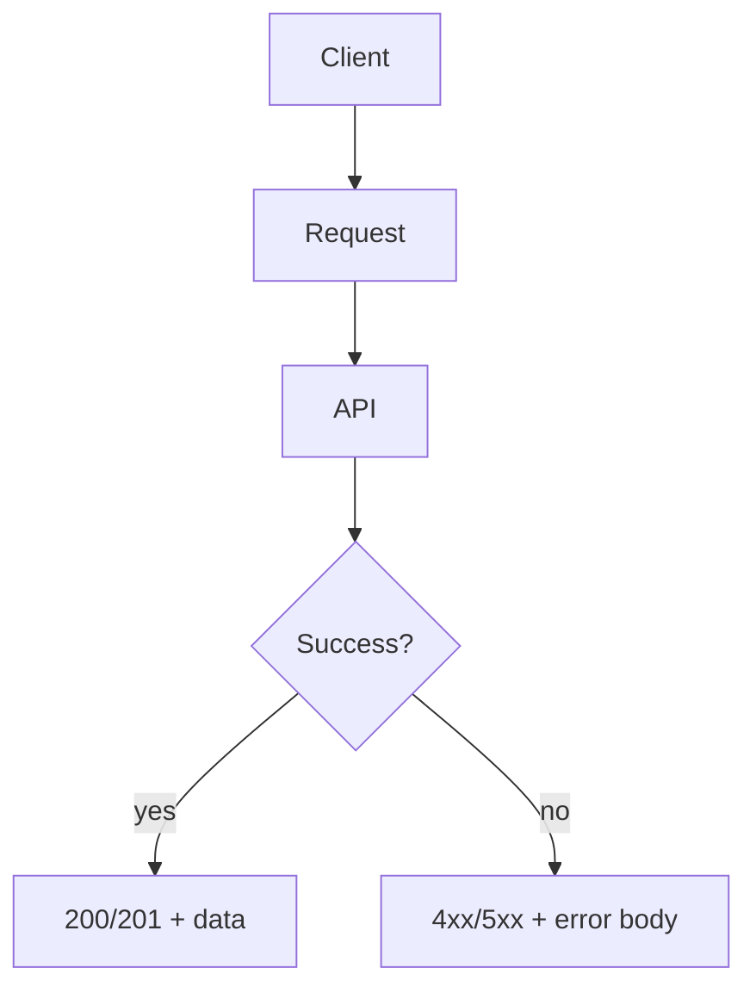

# Lesson 3: Error Responses

## Learning Objectives

By the end of this lesson, you will be able to:
- Design consistent error response shapes for an API
- Map common failure cases to the correct HTTP status codes
- Include safe, useful error details for debugging and client UX
- Avoid leaking sensitive information in production error responses
- Recognize common pitfalls (200-with-error-body, inconsistent formats, noisy details)

## Why Error Responses Matter

When an API fails, clients need to know:
- did it fail because of them (bad input)?
- did it fail because they aren’t authorized?
- did it fail because the server is broken?

Clear, consistent error responses enable:
- better frontend UX (inline form errors, redirect to login)
- easier debugging
- fewer special cases across endpoints



## A Consistent Error Format

```typescript
import type { Response } from "express";

export interface ErrorResponse {
  success: false;
  error: string;
  details?: unknown;
}

export function sendError(
  res: Response,
  error: string,
  status = 500,
  details?: unknown
) {
  const body: ErrorResponse = {
    success: false,
    error,
    ...(details !== undefined ? { details } : {}),
  };
  return res.status(status).json(body);
}
```

### What belongs in `details`?

Good candidates:
- field-level validation issues (e.g., Zod issues)
- a stable internal error code (e.g., `USER_NOT_FOUND`)

Avoid:
- stack traces
- raw DB errors in production

## Common Error Types (and Status Codes)

```typescript
// 400 Bad Request (invalid input)
sendError(res, "Invalid input", 400);

// 401 Unauthorized (not authenticated)
sendError(res, "Authentication required", 401);

// 403 Forbidden (authenticated but not allowed)
sendError(res, "Insufficient permissions", 403);

// 404 Not Found (missing resource)
sendError(res, "Resource not found", 404);

// 409 Conflict (unique constraint / conflicts)
sendError(res, "Email already exists", 409);

// 500 Internal Server Error (unexpected failure)
sendError(res, "Internal server error", 500);
```

## Real-World Scenario: Frontend Form Errors

A good validation response might look like:

```json
{
  "success": false,
  "error": "Validation failed",
  "details": [
    { "path": ["email"], "message": "Invalid email" }
  ]
}
```

This lets a frontend show field-specific errors without guessing.

## Best Practices

### 1) Use correct status codes

Status codes are semantics—clients rely on them.

### 2) Keep error messages user-safe

Don’t expose internal implementation details.

### 3) Be consistent across endpoints

Pick one error format and apply it everywhere (ideally from error middleware).

## Common Pitfalls and Solutions

### Pitfall 1: Returning 200 with an error body

**Problem:** Clients treat failures as success.

**Solution:** Use 4xx/5xx status codes appropriately.

### Pitfall 2: Inconsistent error shapes

**Problem:** Each endpoint invents its own error JSON.

**Solution:** Centralize in helpers + middleware.

### Pitfall 3: Noisy `details`

**Problem:** Responses include huge raw errors that overwhelm clients.

**Solution:** Return only structured, relevant details (issues/codes).

## Troubleshooting

### Issue: Frontend can’t differentiate errors

**Symptoms:**
- all failures look the same

**Solutions:**
1. Add correct status codes.
2. Add stable `details` (codes or issues) for client-side handling.

### Issue: Security review flags error leaks

**Symptoms:**
- stack traces are visible to clients

**Solutions:**
1. Remove stack traces from responses.
2. Log details server-side; return safe messages client-side.

## Next Steps

Now that you can format errors consistently:

1. ✅ **Practice**: Return 400 with field issues for invalid input
2. ✅ **Experiment**: Add 401/403/404 handling to your user routes
3. 📖 **Next Level**: Move to advanced backend topics (uploads, rate limiting, logging)
4. 💻 **Complete Exercises**: Work through [Exercises 05](./exercises-05.md)

## Additional Resources

- [MDN: HTTP status codes](https://developer.mozilla.org/en-US/docs/Web/HTTP/Status)
- [OWASP: Error Handling](https://cheatsheetseries.owasp.org/cheatsheets/Error_Handling_Cheat_Sheet.html)

---

**Key Takeaways:**
- Consistent error shapes + correct status codes make APIs easier to consume.
- Use 400/401/403/404/409 for expected failures; 500 for unexpected ones.
- Include structured details when helpful, but avoid leaking internals.
