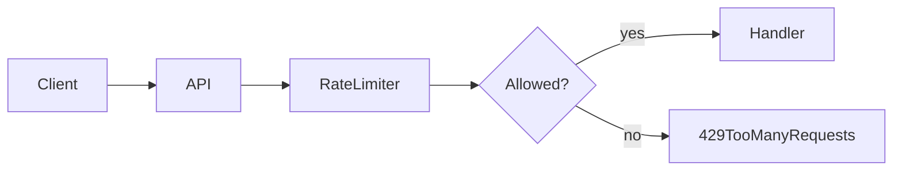

# Lesson 2: Rate Limiting (Long-form Enhanced)

## Table of Contents

- What rate limiting mitigates (and what it doesn’t)
- Global vs endpoint-specific limits
- Proxy/IP considerations
- Troubleshooting
- Advanced patterns: Redis store, per-user limits, sliding windows, and 429 ergonomics

## Learning Objectives

By the end of this lesson, you will be able to:
- Explain what rate limiting is and what threats it mitigates
- Add basic rate limiting to an Express API
- Apply stricter limits to sensitive endpoints (login, password reset)
- Understand trade-offs of IP-based limiting and proxy environments
- Recognize common pitfalls (breaking legitimate users, misconfigured proxies, shared IPs)

## Why Rate Limiting Matters

Rate limiting helps protect your API from:
- brute force login attempts
- abusive scraping
- accidental traffic spikes
- basic denial-of-service patterns

It’s not a full DDoS solution, but it’s a critical baseline defense for many apps.



## Basic Rate Limiting (Global)

```typescript
import rateLimit from "express-rate-limit";

const limiter = rateLimit({
  windowMs: 15 * 60 * 1000, // 15 minutes
  max: 100, // limit each IP to 100 requests per window
});

app.use("/api/", limiter);
```

### What happens when exceeded?

By default, the limiter returns a 429 response (“Too Many Requests”).

## Custom Rate Limits (Sensitive Endpoints)

Login endpoints should be much stricter:

```typescript
import rateLimit from "express-rate-limit";

const authLimiter = rateLimit({
  windowMs: 15 * 60 * 1000,
  max: 5, // 5 attempts per 15 minutes
});

app.use("/api/auth/login", authLimiter);
```

## Real-World Considerations

### IP-based rate limiting limitations

- NAT/shared IPs: many users can appear as one IP (schools, offices)
- proxies/CDNs: your server may see proxy IP unless configured

If you run behind a reverse proxy (common in production), you may need:
- `app.set("trust proxy", 1)` (configuration topic)

### Per-user rate limiting

Sometimes you want limits per user account (or per email) rather than per IP. That’s an advanced pattern that often requires a shared store (Redis).

## Best Practices

### 1) Apply layered limits

- global mild limit
- stricter limits for auth/password reset
- possibly limits for expensive endpoints

### 2) Return helpful metadata

Many rate limiters include headers that help clients back off.

### 3) Log rate limit events

Rate limiting is a security signal; it’s useful for alerting and incident response.

## Common Pitfalls and Solutions

### Pitfall 1: Breaking legitimate traffic

**Problem:** Limits are too strict for normal usage.

**Solution:** Start conservative, observe traffic, and tune.

### Pitfall 2: Misconfigured proxy environment

**Problem:** Everyone appears as the same IP and gets blocked.

**Solution:** Configure proxy trust settings and confirm the real client IP is used.

### Pitfall 3: Treating rate limiting as the only defense

**Problem:** Attackers bypass simple IP rules.

**Solution:** Combine with strong auth, monitoring, and (for scale) dedicated edge protection.

## Troubleshooting

### Issue: All users get rate limited immediately

**Symptoms:**
- constant 429 responses

**Solutions:**
1. Confirm you’re not seeing a single shared IP due to proxy configuration.
2. Confirm limiter is mounted on the intended path only.

### Issue: Login brute force still succeeds

**Symptoms:**
- too many attempts allowed

**Solutions:**
1. Lower `max` for login endpoints.
2. Add account lockouts or incremental backoff (advanced).

---

## Manual Testing (Triggering 429)

PowerShell note: use `curl.exe` (not `curl` alias).

### Simple “spam” test

Adjust the URL to a rate-limited endpoint (example: `/api/health` or `/api/auth/login`).

```powershell
1..120 | ForEach-Object { curl.exe -s -o NUL -w "%{http_code}`n" http://localhost:3001/api/health }
```

### What to verify

- You eventually receive **429 Too Many Requests**
- The response message is clear (and ideally includes retry guidance)
- In production behind a proxy, ensure client IP detection is correct (see `trust proxy`)

---

## Advanced Rate Limiting Patterns (Reference)

### 1) Distributed rate limiting (shared store)

In multi-server deployments, in-memory rate limiting can be inconsistent because each server has its own counters.

Common solution:
- store counters in a shared system like Redis
- configure the limiter store accordingly

### 2) Per-user / per-identifier limits

IP-based limits are imperfect (NAT, shared IPs).
Sometimes you rate limit by:
- user id (after auth)
- email (on login)
- API key

### 3) Window strategies (fixed vs sliding)

Fixed windows are simple but can be “bursty” at the boundary.
Sliding window / token bucket style algorithms feel smoother but require more sophistication (and often Redis).

### 4) 429 ergonomics (help clients behave well)

Best practices when returning 429:
- include a clear message
- include `Retry-After` header if possible
- log rate limit events (it’s a security signal)

### 5) Trust proxy correctness (production)

If you’re behind a proxy/CDN and don’t configure trust proxy correctly, all traffic can appear to come from one IP and get blocked.

Use:

```typescript
app.set("trust proxy", 1);
```

…and validate that the real client IP is used by your limiter.

## Next Steps

Now that you can rate limit your API:

1. ✅ **Practice**: Add global rate limiting to `/api/*`
2. ✅ **Experiment**: Add strict limiter to `/api/auth/login`
3. 📖 **Next Lesson**: Learn about [Logging](./lesson-03-logging.md)
4. 💻 **Complete Exercises**: Work through [Exercises 06](./exercises-06.md)

## Additional Resources

- [express-rate-limit docs](https://github.com/express-rate-limit/express-rate-limit)
- [OWASP: Brute Force Prevention](https://cheatsheetseries.owasp.org/cheatsheets/Authentication_Cheat_Sheet.html)

---

**Key Takeaways:**
- Rate limiting is a baseline defense against abuse and brute force.
- Use a global limiter and stricter limits on sensitive endpoints.
- Be careful with proxies/shared IPs; tune limits based on real traffic.
