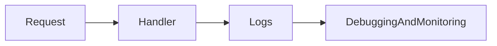

# Lesson 3: Logging

## Learning Objectives

By the end of this lesson, you will be able to:
- Explain why logging is essential for backend observability
- Configure structured logging using Winston
- Add request logging (Morgan) and correlate it with application logs
- Choose what to log (and what not to log) for security and privacy
- Recognize common pitfalls (logging secrets, noisy logs, missing context)

## Why Logging Matters

In production, logs are often your #1 debugging tool.

Logging helps you answer:
- what requests happened?
- what errors occurred?
- what user/action caused the issue?
- how often is a problem happening?



## Structured Logging (Winston)

Structured logs (JSON) are easier to search and analyze than plain strings.

```typescript
import winston from "winston";

export const logger = winston.createLogger({
  level: "info",
  format: winston.format.json(),
  transports: [
    new winston.transports.File({ filename: "error.log", level: "error" }),
    new winston.transports.File({ filename: "combined.log" }),
  ],
});

if (process.env.NODE_ENV !== "production") {
  logger.add(
    new winston.transports.Console({
      format: winston.format.simple(),
    })
  );
}
```

### What gets logged where

- `error.log`: error-level logs only
- `combined.log`: everything at level `info` and above
- console: helpful for local development

## Request Logging (Morgan)

Morgan logs each HTTP request:

```typescript
import morgan from "morgan";

app.use(morgan("combined"));
```

### When to use Morgan vs Winston

- Morgan: request access logs (method/path/status/time)
- Winston: application events (errors, business events, structured context)

Many apps use both: Morgan for request logs and Winston for app logs.

## Adding Context (Recommended)

Logs become far more useful when they include context:
- request id
- user id (if authenticated)
- endpoint name

In a real system, you’d often add a request-id middleware and include it in logs.

## Security and Privacy

Never log:
- passwords
- JWT secrets
- full authorization headers
- sensitive PII unless required (and then protect access)

If you must log user identifiers, prefer stable IDs over emails.

## Real-World Scenario: Debugging a 500 Error

A good logging approach:
1. Morgan shows: `POST /api/users 500`
2. Winston logs the stack trace and context (`userId`, `requestId`)
3. You can correlate and reproduce quickly

## Best Practices

### 1) Use structured logs in production

JSON logs work better with log aggregation tools.

### 2) Log errors with enough context

Log the error message, stack trace, and key request details (but not secrets).

### 3) Avoid noisy logs

Excessive logs make real issues harder to spot and can increase costs.

## Common Pitfalls and Solutions

### Pitfall 1: Logging secrets

**Problem:** tokens/passwords end up in logs.

**Solution:** redact sensitive fields and avoid logging raw headers/bodies.

### Pitfall 2: Only logging strings

**Problem:** logs are hard to search/aggregate.

**Solution:** use structured JSON logs in production.

### Pitfall 3: Missing error stacks

**Problem:** “Something failed” but you don’t know where.

**Solution:** log error stacks server-side; return safe errors to clients.

## Troubleshooting

### Issue: No logs in production

**Symptoms:**
- app fails but you see nothing

**Solutions:**
1. Ensure your logger writes to stdout (common in containers) or to an accessible file.
2. Confirm log level isn’t too restrictive.

### Issue: Logs are too noisy

**Symptoms:**
- hard to find real issues

**Solutions:**
1. Reduce log level in production.
2. Filter request logs or exclude health checks from logging.

## Next Steps

Now that you can log effectively:

1. ✅ **Practice**: Add Winston logger and log one “business event” (e.g., user created)
2. ✅ **Experiment**: Add Morgan request logging and compare output
3. 📖 **Next Step**: Finish backend lessons, then proceed to the database course lessons
4. 💻 **Complete Exercises**: Work through [Exercises 06](./exercises-06.md)

## Additional Resources

- [Winston Docs](https://github.com/winstonjs/winston)
- [Morgan Docs](https://github.com/expressjs/morgan)
- [OWASP: Logging Cheat Sheet](https://cheatsheetseries.owasp.org/cheatsheets/Logging_Cheat_Sheet.html)

---

**Key Takeaways:**
- Logging is essential for debugging and production observability.
- Use Morgan for request logs and Winston for structured application logs.
- Log context, not secrets; keep logs readable and actionable.
